# CI / CD — TaskOrbit Conversational Agent

This document is the team-facing guide to the GitHub Actions pipeline. It
covers what the pipeline does, how to reproduce its checks locally, how to
debug a red build, and how to extend the pipeline as the project grows.

---

## Where the workflow files live

| File                                            | Badge label          | What it does                                                                          |
| ----------------------------------------------- | -------------------- | ------------------------------------------------------------------------------------- |
| `.github/workflows/backend-lint.yml`            | **Backend Linting**   | Backend pipeline — install → ruff check → ruff format --check → pytest                |
| `.github/workflows/frontend-lint.yml`           | **Frontend Linting**  | Frontend pipeline — `npm ci` → ESLint → Prettier `--check`                            |
| `.github/workflows/start-web-service.yml`       | **Start Web Service** | Smoke test — boot the FastAPI service and curl `/health`; build the frontend bundle  |
| `.github/actions/backend-bootstrap`             | _(composite)_         | Python + Poetry + cache + `poetry install`                                            |
| `.github/actions/frontend-bootstrap`            | _(composite)_         | Node + npm cache + `npm ci`                                                           |

Each top-level workflow has its **own status badge** at the top of the
repository [`README.md`](../README.md). The three workflows are
independent: a regression in one doesn't block the others from running,
which makes failures easier to localise on the PR checks page.

---

## When the pipeline runs

All three workflows trigger on the same events:

- **Every push** to any branch.
- **Every pull request** (regardless of target branch).
- **Manual `workflow_dispatch`** — re-run from the Actions tab without
  having to push.

There are no `paths:` filters — every push and PR runs every workflow so
the team always sees the same, predictable set of checks. Inside each
workflow, jobs are chained with `needs:` so a broken stage short-circuits
the run and the later (more expensive) stages don't waste runner minutes.

Each workflow has its own `concurrency` group so a fresh push to the
same branch cancels the previous in-flight run for that workflow only —
saving runner minutes during fast iteration without affecting the others.

---

## What the pipelines do

Each workflow checks out the repo and uses the shared bootstrap
composite (Python+Poetry+venv cache, or Node+npm cache) at the start of
every job. Steps inside a workflow run sequentially via `needs:`; the
three workflows themselves run in parallel.

```mermaid
flowchart LR
  subgraph BL [Backend Linting workflow]
    direction LR
    B1[1 Install] --> B2[2 Lint] --> B3[3 Format] --> B4[4 Tests]
  end
  subgraph FL [Frontend Linting workflow]
    direction LR
    F1[1 Install] --> F2[2 Lint] --> F3[3 Format]
  end
  subgraph WS [Start Web Service workflow]
    direction LR
    W1[Backend boot &#43; /health]
    W2[Frontend production build]
  end
```



### Backend Linting (`backend-lint.yml`)

| Job id (for `act -j`) | Display name                | What it runs                      |
| --------------------- | --------------------------- | --------------------------------- |
| `install`             | 1. Install                  | Bootstrap + import smoke check    |
| `lint`                | 2. Lint (ruff check)        | Bootstrap + `ruff check .`        |
| `format`              | 3. Format (ruff format)     | Bootstrap + `ruff format --check` |
| `tests`               | 4. Tests (pytest)           | Bootstrap + `pytest`              |

- Python `3.11` matches `backend/.python-version` and `backend/Dockerfile`.
- `ruff` is configured in `backend/pyproject.toml` (`[tool.ruff]`).
- `pytest` configuration lives in `[tool.pytest.ini_options]`. All current
  tests use mocks for LiveKit/Postgres, so no real services or secrets are
  required in CI.

### Frontend Linting (`frontend-lint.yml`)

| Job id (for `act -j`) | Display name                  | What it runs                       |
| --------------------- | ----------------------------- | ---------------------------------- |
| `install`             | 1. Install                    | Bootstrap + tool versions          |
| `lint`                | 2. Lint (ESLint)              | Bootstrap + `npm run lint`         |
| `format`              | 3. Format (Prettier --check)  | Bootstrap + `npm run format:check` |

- Node `20` LTS.
- ESLint flat config in `frontend/eslint.config.js`, Prettier config in
  `frontend/.prettierrc.json`, ignore lists in `frontend/.prettierignore`.
- The lint step fails on **errors** only. Warnings (for example, the
  `react-refresh/only-export-components` advisories triggered by some
  shadcn-generated components) are printed but do not fail the build.
  To gate on a specific warning, raise its severity to `error` in the
  flat config rather than reintroducing `--max-warnings=0` globally.
- No test step — there is no test suite yet (see "Extending" below).

### Start Web Service (`start-web-service.yml`)

A smoke-test pipeline that proves both halves of the stack actually
*start* — not just lint clean. This catches breakages that lint can't
see (missing imports, broken bootstraps, broken Vite/TypeScript builds).

| Job id (for `act -j`) | Display name                 | What it runs                                                                                          |
| --------------------- | ---------------------------- | ----------------------------------------------------------------------------------------------------- |
| `backend`             | Backend — boot & /health     | Boots `taskorbit-api` on `127.0.0.1:8000`, polls `/health`, asserts `"status":"ok"`, then tears down  |
| `frontend`            | Frontend — production build  | `npm run build` (which runs `tsc -b && vite build`); checks `dist/index.html` exists                  |

- The backend job runs with `APP_ENV=production` so `uvicorn` does **not**
  enable auto-reload. Auto-reload spawns a worker subprocess and changes
  PID handling; production mode keeps the PID stable and cleanup simple.
- `/health` does not touch the database, so this smoke test does not
  require Postgres or any other external service.
- On failure, the API log is uploaded as a workflow artifact
  (`backend-smoke-api-log`) for offline inspection.

---

## Caching

| Layer                    | Cached path           | Key                                                |
| ------------------------ | --------------------- | -------------------------------------------------- |
| Backend pip wheels       | `~/.cache/pip`        | Managed by `actions/setup-python` (`cache: pip`)   |
| Backend Poetry venv      | `backend/.venv`       | `poetry-v1-${{ hashFiles('backend/poetry.lock') }}` |
| Frontend npm registry    | `~/.npm`              | Managed by `actions/setup-node` (`cache: npm`)     |

The `.venv` cache key includes the lockfile hash, so changing
`backend/poetry.lock` automatically invalidates the cache. If a cache ever
gets poisoned (e.g. a partial install), bump the `v1` segment in the cache
key in `.github/actions/backend-bootstrap/action.yml`.

---

## Pre-commit hooks (recommended)

The repository ships a [`pre-commit`](https://pre-commit.com/) config at
[`.pre-commit-config.yaml`](../.pre-commit-config.yaml) that runs the same
lint/format checks **automatically on every `git commit`**, scoped to the
files you actually staged. This catches issues before they reach CI.

What runs on commit:

- **Generic hygiene** — trim trailing whitespace, fix end-of-file newline,
  check YAML/TOML, check for merge conflict markers, block large files
  (>1 MB).
- **Backend** — `ruff --fix` (lint, auto-applies safe fixes) and
  `ruff format` (format) for any staged `.py` file under `backend/`.
- **Frontend** — `eslint --fix` and `prettier --write` for any staged
  `.ts`/`.tsx`/`.css` file under `frontend/`. These call the project's
  own `frontend/node_modules/.bin/` binaries, so the exact pinned
  versions from `package-lock.json` are used.

### One-time setup (Poetry-based, recommended)

`pre-commit` is already declared in `backend/pyproject.toml`'s dev
dependencies (`pre-commit = "^4.0.0"`), so `poetry install` in `backend/`
is the only install you need.

```bash
# 1. Install backend dev deps — this brings in pre-commit, ruff, pytest, etc.
cd backend && poetry install --with dev && cd ..

# 2. Wire the git hook. Run from the repo root so pre-commit can find
#    .pre-commit-config.yaml. `poetry -C backend run` uses the venv
#    from backend/ but keeps your shell at the repo root.
poetry -C backend run pre-commit install

# 3. Frontend hooks call the project's local node_modules binaries.
cd frontend && npm install && cd ..
```

After step 2, every `git commit` automatically runs the hooks against the
files you staged. Hooks that auto-fix (ruff, prettier, eslint) will write
the corrected file to disk; in that case the commit aborts so you can
re-stage and re-run `git commit`.

### Alternative: install pre-commit standalone

If you'd rather not depend on the backend Poetry env (e.g. you only work
on the frontend), any of these work too:

```bash
pip install --user pre-commit          # system Python
brew install pre-commit                # macOS Homebrew
pipx install pre-commit                # if you use pipx
```

Then run `pre-commit install` from the repo root.

### Useful commands

All of these run from the repo root. Replace `pre-commit` with
`poetry -C backend run pre-commit` if you went the Poetry route and don't
have the standalone binary on PATH.

```bash
poetry -C backend run pre-commit run --all-files     # run every hook against the whole repo
poetry -C backend run pre-commit run ruff --all-files # run a single hook
poetry -C backend run pre-commit autoupdate          # bump rev pins in .pre-commit-config.yaml
git commit --no-verify                                # bypass hooks (use sparingly)
```

> Note: bypassing with `--no-verify` is fine for emergency commits, but
> CI still runs the same checks on the PR, so the failure shifts there.

---

## Run the same checks locally

Reproducing CI locally before pushing is the fastest way to keep the
pipeline green.

### Backend

```bash
cd backend

poetry install --with dev          # one-time / when deps change
poetry run ruff check .            # lint
poetry run ruff format --check .   # formatting check (no rewrites)
poetry run pytest                  # unit tests

# Auto-fix what can be fixed:
poetry run ruff check --fix .      # apply auto-fixable lint rules
poetry run ruff format .           # rewrite files to canonical format
```

### Frontend

```bash
cd frontend

npm ci                             # one-time / when lockfile changes
npm run lint                       # ESLint over the whole repo
npm run format:check               # Prettier check (no rewrites)

# Auto-fix what can be fixed:
npm run lint -- --fix              # apply auto-fixable ESLint rules
npm run format                     # rewrite files via prettier --write
```

---

## Troubleshooting common failures

| Symptom in the failed job                                          | Likely cause                                                                                                       | Fix                                                                                                          |
| ------------------------------------------------------------------ | ------------------------------------------------------------------------------------------------------------------ | ------------------------------------------------------------------------------------------------------------ |
| `ruff check` reports errors                                        | New code violates a lint rule                                                                                       | Run `poetry run ruff check --fix .` then commit. Inspect the rule docs for any remaining manual fixes.        |
| `ruff format --check` exits non-zero                               | A file in the diff is not Prettier-/ruff-formatted                                                                  | Run `poetry run ruff format .` and commit the result.                                                         |
| `pytest` fails on a single test                                    | Genuine regression                                                                                                  | Reproduce locally with `poetry run pytest tests/path/to/test_file.py::test_name -x -vv`.                      |
| `pytest` fails on `ModuleNotFoundError`                            | A new dep was added with `poetry add` but `poetry.lock` wasn't committed                                            | Commit the updated `poetry.lock`. CI restores the venv from the lockfile hash, so a stale lockfile is invisible until install runs. |
| `eslint` complains about `Could not find config file`              | Someone deleted `frontend/eslint.config.js` or moved it                                                             | Restore the flat config; ESLint v9 requires it.                                                              |
| `prettier --check` flags many files                                | A new contributor's editor isn't running Prettier                                                                   | Run `npm run format` once and commit. Add the Prettier extension to your editor and enable "format on save". |
| `npm ci` fails with `lock file out of sync`                        | `package.json` changed without re-running `npm install`                                                             | Run `npm install` locally, commit the updated `package-lock.json`.                                            |
| Cached venv looks stale (e.g. wrong package versions)              | A force-pushed `poetry.lock` collided with an older cache key                                                       | Bump the `v1` token in the cache key inside `.github/actions/backend-bootstrap/action.yml` — that invalidates every existing cache entry. |
| Workflow does not run on a PR                                      | The workflow file or composite action was changed in a way GitHub couldn't parse                                    | Open the Actions tab and check for a "Workflow file invalid" error.                                          |
| `poetry: command not found` after the install step                 | `~/.local/bin` is not on PATH                                                                                       | Already handled — the workflow appends it to `$GITHUB_PATH`. If you re-introduce a custom Poetry install, do the same. |
| ESLint warnings appear but build still passes                      | By design — only errors fail the gate. Warnings are advisory.                                                        | Promote a specific rule to `"error"` in `frontend/eslint.config.js` if you want it gated.                    |
| Pre-commit: `eslint: command not found` or `prettier: command not found` | `frontend/node_modules` is missing — the local frontend hooks reuse the project's pinned binaries                  | Run `cd frontend && npm install`. Re-run `git commit`.                                                       |
| `pre-commit: command not found` when running `poetry ... run pre-commit` | Backend dev deps not installed yet                                                                                  | Run `cd backend && poetry install --with dev`.                                                               |
| Pre-commit hook auto-fixed files and the commit aborted            | Expected behaviour — ruff/prettier/eslint rewrite the file on disk so you can review the fix                         | `git add -u` (or stage the fixed paths) and re-run `git commit`.                                              |
| Pre-commit `check-yaml` flags a workflow file                      | Real YAML syntax error                                                                                                | Fix the YAML, or scope the file in `.pre-commit-config.yaml` if false positive.                              |
| Start Web Service: `API never became healthy`                      | The FastAPI service crashed on import or failed to bind `:8000` within 30 seconds                                     | Open the failed run, download the `backend-smoke-api-log` artifact, and read the uvicorn traceback. Reproduce locally with `cd backend && APP_ENV=production poetry run taskorbit-api --host 127.0.0.1 --port 8000`. |
| Start Web Service: backend `/health` payload assertion fails       | A regression changed the `/health` response contract                                                                  | Either restore `status: ok` and `service: taskorbit-backend`, or update the Python assertion block in `start-web-service.yml` if the contract changed intentionally. |
| Start Web Service: `npm run build` fails on a TypeScript error     | A new `.ts`/`.tsx` change introduces a type error that ESLint doesn't catch                                           | Reproduce locally with `cd frontend && npm run build`. Fix the type or, if intentional, add a `// @ts-expect-error` with justification. |

If a step's logs aren't enough to diagnose the issue, click the failing job
and download the run logs as an artifact for offline inspection.

---

## How to extend the pipeline

### Add type checking (recommended next step)

The projects already configure type checkers; they just aren't gated yet.
Add a new job inside the existing workflow that owns each language.

Backend — add a job between `format` and `tests` in
`.github/workflows/backend-lint.yml`:

```yaml
  typecheck:
    name: "3b. Type-check (mypy)"
    runs-on: ubuntu-latest
    needs: format
    steps:
      - uses: actions/checkout@v4
      - uses: ./.github/actions/backend-bootstrap
        with:
          python-version: ${{ env.PYTHON_VERSION }}
          poetry-version: ${{ env.POETRY_VERSION }}
      - name: Type-check with mypy
        working-directory: backend
        run: poetry run mypy src
```

Frontend — add a job after `format` in
`.github/workflows/frontend-lint.yml`:

```yaml
  typecheck:
    name: "4. Type-check (tsc)"
    runs-on: ubuntu-latest
    needs: format
    steps:
      - uses: actions/checkout@v4
      - uses: ./.github/actions/frontend-bootstrap
        with:
          node-version: ${{ env.NODE_VERSION }}
      - name: Type-check with tsc
        working-directory: frontend
        run: npm run type-check
```

> Note: `npm run build` in the **Start Web Service** workflow already
> runs `tsc -b`, so a TypeScript regression will fail there too. Adding
> a dedicated `typecheck` job in `frontend-lint.yml` just gives faster
> feedback (no Vite build needed).

### Add a frontend test job

When tests land, add a `tests` job to `frontend-lint.yml` that depends on
`format`:

```yaml
  tests:
    name: "4. Tests"
    runs-on: ubuntu-latest
    needs: format
    steps:
      - uses: actions/checkout@v4
      - uses: ./.github/actions/frontend-bootstrap
        with:
          node-version: ${{ env.NODE_VERSION }}
      - name: Run unit tests
        working-directory: frontend
        run: npm test -- --run
```

…and update this document to mention the new step.

### Add a Docker image build

Both apps ship a multi-stage `Dockerfile`. A separate workflow
(`docker-build.yml`) can build and (optionally) push images on tags or on
`main`:

```yaml
      - uses: docker/setup-buildx-action@v3
      - uses: docker/build-push-action@v6
        with:
          context: ./backend
          target: prod
          push: false
```

### Add a deployment workflow

Recommended pattern: a separate workflow (`deploy.yml`) triggered on
`workflow_run` after the lint/smoke workflows succeed on `main` (for
example after **Backend Linting**, **Frontend Linting**, and **Start Web
Service** all complete). It can reuse the Docker image built in the build
workflow and push to the target environment via OIDC, secrets, or
environment-protected jobs.

### Branch protection — merges require CI to pass

The default branch (`main`) is protected via GitHub's branch-protection
settings (**Settings → Branches → main**) so that a pull request can be
merged only after every CI workflow has passed and at least one reviewer
has approved. The required status checks tracked there are:

- `Backend Linting / 4. Tests (pytest)`
- `Frontend Linting / 3. Format (Prettier --check)`
- `Start Web Service / Backend — boot & /health`
- `Start Web Service / Frontend — production build`

> **Why these four checks?** Each CI workflow chains its stages with
> `needs:`. The terminal job only goes green when every earlier stage
> went green, so requiring just the last job of each chain effectively
> requires the entire pipeline. Listing only four checks also dodges
> name collisions between the two lint workflows (both have a job
> called `1. Install`).

---

## Suggested project-structure improvements

The current monorepo layout works well with the per-concern workflow
strategy used here. A few light improvements would make the pipeline
even more scalable:

- Add a top-level `Makefile` or `justfile` that wraps `poetry run …` and
  `npm run …` so contributors and CI can call the same target name
  (e.g. `make lint`, `make test`). This removes the surface area where CI
  and local commands can drift.
- Track Python and Node versions in a single `.tool-versions` file (asdf /
  mise) and reference it from both bootstrap composites so a version bump
  is a one-line change.
- When a new service lands (e.g. a LiveKit worker), add a focused
  workflow file with its own badge — e.g. `worker-lint.yml` — alongside
  the existing three. The composite actions already encapsulate
  bootstrap, so a new workflow is only the jobs/stages plus the bootstrap
  call.

---

## Quick reference

```bash
# Backend Linting workflow
cd backend
poetry install --with dev
poetry run ruff check . && poetry run ruff format --check . && poetry run pytest

# Frontend Linting workflow
cd frontend
npm ci
npm run lint && npm run format:check

# Start Web Service workflow
cd backend && APP_ENV=production poetry run taskorbit-api --host 127.0.0.1 --port 8000 &
curl -fsS http://127.0.0.1:8000/health    # expect {"status":"ok",...}
kill %1
cd ../frontend && npm run build           # tsc + vite build
```

If those commands pass locally, all three workflows will be green.
