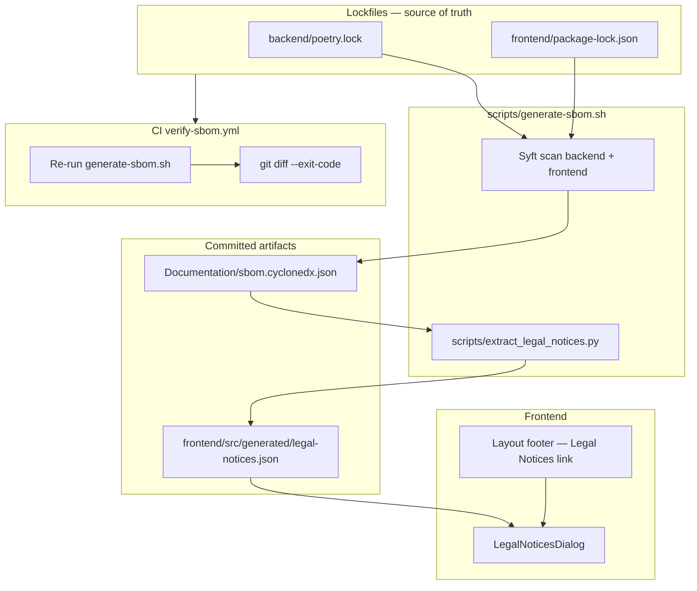

# Issue #138 — SBOM handoff pack

> **Saved from `Feature-Component-Benchmarking-68`** before SBOM work was removed from that branch.
> Implement on branch: `feature/138-sbom-legal-notices-ui` (from `main`).

## What to do on the SBOM branch

1. Create files below at the listed paths (copy each code block).
2. Apply the **mixed-file patches** in section 2.
3. Run `./scripts/generate-sbom.sh` to create large generated artifacts (do not copy by hand):
   - `Documentation/sbom.cyclonedx.json` (~247 components)
   - `frontend/src/generated/legal-notices.json` (~245 components)
4. Recover sprint deliverables if needed:
   ```bash
   git show eefccdd:Deliverables/sprint-12/bill-of-materials-syft-export.csv > Deliverables/sprint-12/bill-of-materials-syft-export.csv
   git show eefccdd:Deliverables/sprint-12/planning-documents.xlsx > Deliverables/sprint-12/planning-documents.xlsx
   git show eefccdd:Deliverables/sprint-12/sbom-metadata-for-planning-doc.txt > Deliverables/sprint-12/sbom-metadata-for-planning-doc.txt
   ```
5. Full implementation plan: see `Documentation/issue-138-sbom-legal-notices-plan.md` (also in section 1 below).

## CI notes (important)

- Pin Syft to **v1.38.2** in `verify-sbom.yml` (matches Homebrew syft).
- `generate-sbom.sh` uses **deterministic** `timestamp` + `serialNumber` from lockfiles/components so CI `git diff` is stable.
- `extract_legal_notices.py` sets `generatedAt` from the SBOM metadata timestamp.

---

## 1. Source files

### `scripts/generate-sbom.sh`

```bash
#!/usr/bin/env bash
# ------------------------------------------------------------------
# generate-sbom.sh — SBOM generation and legal notices extraction.
#
# Orchestrates:
#   1. Syft scan of backend (Poetry) + frontend (npm)
#   2. Write combined CycloneDX JSON to Documentation/sbom.cyclonedx.json
#   3. Run extract_legal_notices.py to produce frontend/src/generated/legal-notices.json
#
# Prerequisites:
#   - syft installed on PATH  (https://github.com/anchore/syft)
#   - python3 available (stdlib only for extraction)
#
# Usage:
#   ./scripts/generate-sbom.sh
# ------------------------------------------------------------------
set -euo pipefail

SCRIPT_DIR="$(cd "$(dirname "${BASH_SOURCE[0]}")" && pwd)"
REPO_ROOT="$(cd "$SCRIPT_DIR/.." && pwd)"

# ── Preflight ──────────────────────────────────────────────────────────

if ! command -v syft &>/dev/null; then
  echo "ERROR: 'syft' not found on PATH. Install it first:"
  echo "  brew install syft         # macOS"
  echo "  or see https://github.com/anchore/syft"
  exit 1
fi

# ── Scan ───────────────────────────────────────────────────────────────

echo "==> Scanning backend (Poetry) with Syft ..."

syft scan "dir:$REPO_ROOT/backend" \
  --exclude './**/__pycache__/**' \
  --exclude './**/.venv/**' \
  --exclude './**/tests/**' \
  -o cyclonedx-json@1.5 \
  -q > "/tmp/sbom-backend.json"

echo "   -> backend scan complete ($(python3 -c "import json; print(len(json.load(open('/tmp/sbom-backend.json'))['components']))") components)"

echo "==> Scanning frontend (npm) with Syft ..."

syft scan "dir:$REPO_ROOT/frontend" \
  --exclude './node_modules/**' \
  --exclude './dist/**' \
  -o cyclonedx-json@1.5 \
  -q > "/tmp/sbom-frontend.json"

echo "   -> frontend scan complete ($(python3 -c "import json; print(len(json.load(open('/tmp/sbom-frontend.json'))['components']))") components)"

echo "==> Merging scans into combined CycloneDX BOM ..."

python3 -c "
import hashlib
import json
import os
from datetime import datetime, timezone

repo_root = '$REPO_ROOT'

with open('/tmp/sbom-backend.json') as f:
    be = json.load(f)
with open('/tmp/sbom-frontend.json') as f:
    fe = json.load(f)

merged = dict(be)
components = be.get('components', []) + fe.get('components', [])
merged['components'] = components
merged['metadata']['component']['name'] = 'taskorbit-conversational-agent'
merged['metadata']['component']['description'] = 'TaskOrbit Conversational Agent (backend + frontend)'

lock_paths = [
    os.path.join(repo_root, 'backend/poetry.lock'),
    os.path.join(repo_root, 'frontend/package-lock.json'),
]
lock_mtimes = [os.path.getmtime(path) for path in lock_paths if os.path.exists(path)]
if lock_mtimes:
    timestamp = datetime.fromtimestamp(max(lock_mtimes), tz=timezone.utc).strftime('%Y-%m-%dT%H:%M:%SZ')
else:
    timestamp = datetime.fromtimestamp(0, tz=timezone.utc).strftime('%Y-%m-%dT%H:%M:%SZ')
merged['metadata']['timestamp'] = timestamp

payload = json.dumps(components, sort_keys=True, separators=(',', ':')).encode('utf-8')
digest = hashlib.sha256(payload).hexdigest()
merged['serialNumber'] = (
    f'urn:uuid:{digest[:8]}-{digest[8:12]}-{digest[12:16]}-{digest[16:20]}-{digest[20:32]}'
)

print(json.dumps(merged, indent=2))
" > "$REPO_ROOT/Documentation/sbom.cyclonedx.json"

echo "   -> Documentation/sbom.cyclonedx.json written ($(python3 -c "import json; print(len(json.load(open('$REPO_ROOT/Documentation/sbom.cyclonedx.json'))['components']))") components)"

# ── Extract legal notices ──────────────────────────────────────────────

echo "==> Extracting legal notices for UI ..."

python3 "$SCRIPT_DIR/extract_legal_notices.py" \
  --input "$REPO_ROOT/Documentation/sbom.cyclonedx.json" \
  --output "$REPO_ROOT/frontend/src/generated/legal-notices.json"

echo "   -> frontend/src/generated/legal-notices.json written"

# ── Summary ────────────────────────────────────────────────────────────

COMPONENT_COUNT=$(python3 -c "
import json, sys
with open('$REPO_ROOT/Documentation/sbom.cyclonedx.json') as f:
    bom = json.load(f)
print(len(bom.get('components', [])))
")
TIMESTAMP=$(date -u +"%Y-%m-%dT%H:%M:%SZ")

echo ""
echo "✔ SBOM regeneration complete"
echo "  Components : $COMPONENT_COUNT"
echo "  Timestamp  : $TIMESTAMP"
```

### `scripts/extract_legal_notices.py`

```python
#!/usr/bin/env python3
"""Extract legal-notices.json from a CycloneDX SBOM for the Legal Notices UI.

Reads a CycloneDX JSON v1.5 SBOM (produced by Syft), extracts license
information for every package component, deduplicates, sorts, and writes a
lightweight JSON file consumed by the frontend Legal Notices dialog.

Usage:
  python3 scripts/extract_legal_notices.py \\
    --input Documentation/sbom.cyclonedx.json \\
    --output frontend/src/generated/legal-notices.json

Stdlib only — no external dependencies.
"""
from __future__ import annotations

import argparse
import json
import os
import sys
from typing import Any


def resolve_license(component: dict[str, Any]) -> str:
    licenses = component.get("licenses")
    if not licenses:
        return "UNKNOWN"
    lic = licenses[0].get("license", {})
    spdx_id = lic.get("id")
    if spdx_id:
        return spdx_id
    name = lic.get("name")
    if name:
        return name
    return "UNKNOWN"


def extract_legal_notices(sbom_path: str) -> dict[str, Any]:
    with open(sbom_path, "r", encoding="utf-8") as f:
        bom = json.load(f)

    components = bom.get("components", [])
    seen: set[tuple[str, str, str]] = set()
    extracted: list[dict[str, Any]] = []

    for comp in components:
        purl = comp.get("purl", "")
        if not purl.startswith("pkg:"):
            continue

        name = comp.get("name", "").lower()
        version = comp.get("version", "")
        ecosystem = comp.get("type", "unknown")
        license_str = resolve_license(comp)

        key = (ecosystem, name, version)
        if key in seen:
            continue
        seen.add(key)

        extracted.append({
            "name": comp.get("name", ""),
            "version": version,
            "license": license_str,
            "ecosystem": ecosystem,
            "purl": purl,
        })

    extracted.sort(key=lambda c: (c["ecosystem"], c["name"].lower(), c["version"]))

    generated_at = bom.get("metadata", {}).get("timestamp", "")
    if not generated_at:
        generated_at = "1970-01-01T00:00:00Z"

    return {
        "generatedAt": generated_at,
        "sbomVersion": "1.5",
        "scope": ["backend", "frontend"],
        "componentCount": len(extracted),
        "components": extracted,
    }


def main(argv: list[str] | None = None) -> int:
    argv = argv or sys.argv[1:]
    parser = argparse.ArgumentParser(
        description="Extract legal notices from CycloneDX SBOM"
    )
    parser.add_argument(
        "--input",
        required=True,
        help="Path to CycloneDX JSON input (e.g. Documentation/sbom.cyclonedx.json)",
    )
    parser.add_argument(
        "--output",
        required=True,
        help="Path to write legal-notices.json (e.g. frontend/src/generated/legal-notices.json)",
    )
    args = parser.parse_args(argv)

    if not os.path.exists(args.input):
        print(f"ERROR: input file not found: {args.input}", file=sys.stderr)
        return 1

    result = extract_legal_notices(args.input)

    output_dir = os.path.dirname(args.output)
    if output_dir:
        os.makedirs(output_dir, exist_ok=True)

    with open(args.output, "w", encoding="utf-8") as f:
        json.dump(result, f, indent=2)
        f.write("\n")

    print(f"Legal notices written to {args.output} ({result['componentCount']} components)")
    return 0


if __name__ == "__main__":
    sys.exit(main())
```

### `.github/workflows/verify-sbom.yml`

```yaml
name: Verify SBOM

on:
  push:
    branches: ["**"]
  pull_request:
  workflow_dispatch:

jobs:
  verify-sbom:
    runs-on: ubuntu-latest
    timeout-minutes: 10
    steps:
      - uses: actions/checkout@v4

      - name: Install Syft
        uses: anchore/syft-action@v1
        with:
          version: v1.38.2

      - name: Regenerate SBOM artifacts
        run: ./scripts/generate-sbom.sh

      - name: Verify committed artifacts are up to date
        run: |
          git diff --exit-code \
            Documentation/sbom.cyclonedx.json \
            frontend/src/generated/legal-notices.json \
          || (echo "::error::SBOM artifacts are stale. Run ./scripts/generate-sbom.sh and commit." && exit 1)
```

### `frontend/src/components/LegalNoticesDialog.tsx`

```tsx
import { useMemo, useState } from "react";

import { Badge } from "@/components/ui/badge";
import { Button } from "@/components/ui/button";
import {
  Dialog,
  DialogContent,
  DialogDescription,
  DialogHeader,
  DialogTitle,
  DialogTrigger,
} from "@/components/ui/dialog";
import { Input } from "@/components/ui/input";
import { ScrollArea } from "@/components/ui/scroll-area";
import legalNotices from "@/generated/legal-notices.json";
import { cn } from "@/lib/utils";
import type { LegalNoticesFile } from "@/types/legalNotices";

const data = legalNotices as LegalNoticesFile;

function ecosystemFromPurl(purl?: string): string {
  if (!purl) return "unknown";
  if (purl.startsWith("pkg:pypi")) return "python";
  if (purl.startsWith("pkg:npm")) return "npm";
  if (purl.startsWith("pkg:gem")) return "ruby";
  if (purl.startsWith("pkg:docker")) return "docker";
  if (purl.startsWith("pkg:golang")) return "go";
  if (purl.startsWith("pkg:maven")) return "java";
  if (purl.startsWith("pkg:cargo")) return "rust";
  return "other";
}

const ECOSYSTEM_STYLES: Record<string, string> = {
  python: "bg-blue-100 text-blue-800 dark:bg-blue-900 dark:text-blue-200",
  npm: "bg-green-100 text-green-800 dark:bg-green-900 dark:text-green-200",
};

export function LegalNoticesDialog() {
  const [open, setOpen] = useState(false);
  const [search, setSearch] = useState("");

  const filtered = useMemo(() => {
    if (!search.trim()) return data.components;
    const q = search.toLowerCase();
    return data.components.filter(
      (c) => c.name.toLowerCase().includes(q) || c.license.toLowerCase().includes(q),
    );
  }, [search]);

  return (
    <Dialog open={open} onOpenChange={setOpen}>
      <DialogTrigger asChild>
        <Button
          variant="link"
          className="h-auto p-0 text-xs text-muted-foreground hover:text-foreground"
        >
          Legal Notices
        </Button>
      </DialogTrigger>
      <DialogContent className="sm:max-w-2xl">
        <DialogHeader>
          <DialogTitle>Legal Notices</DialogTitle>
          <DialogDescription>
            Open-source licenses for third-party software used in{" "}
            {import.meta.env.VITE_APP_NAME ?? "TaskOrbit"}.
          </DialogDescription>
        </DialogHeader>

        <div className="flex items-center gap-2">
          <Input
            placeholder="Search by package name or license type…"
            value={search}
            onChange={(e) => setSearch(e.target.value)}
            className="h-9"
          />
          <span className="shrink-0 text-xs text-muted-foreground">
            {filtered.length} of {data.componentCount}
          </span>
        </div>

        <ScrollArea className="max-h-[60vh]">
          <table className="w-full text-sm">
            <thead>
              <tr className="border-b text-left text-xs text-muted-foreground">
                <th className="pb-2 pr-2 font-medium">Package</th>
                <th className="pb-2 pr-2 font-medium">Version</th>
                <th className="pb-2 pr-2 font-medium">License</th>
                <th className="pb-2 font-medium">Ecosystem</th>
              </tr>
            </thead>
            <tbody>
              {filtered.map((c) => {
                const eco = ecosystemFromPurl(c.purl);
                return (
                  <tr key={c.purl ?? `${c.name}@${c.version}`} className="border-b last:border-0">
                    <td className="py-1.5 pr-2 font-medium">{c.name}</td>
                    <td className="py-1.5 pr-2 text-muted-foreground">{c.version}</td>
                    <td className="py-1.5 pr-2">
                      <span
                        className={cn(c.license === "UNKNOWN" && "text-muted-foreground italic")}
                        title={
                          c.license === "UNKNOWN"
                            ? "License could not be determined from the package metadata"
                            : c.license
                        }
                      >
                        {c.license}
                      </span>
                    </td>
                    <td className="py-1.5">
                      <Badge
                        variant="outline"
                        className={cn("text-[10px] leading-none", ECOSYSTEM_STYLES[eco])}
                      >
                        {eco}
                      </Badge>
                    </td>
                  </tr>
                );
              })}
            </tbody>
          </table>
        </ScrollArea>

        <p className="text-[10px] text-muted-foreground">
          Generated {data.generatedAt} · {data.componentCount} components across{" "}
          {data.scope.join(", ")}
        </p>
      </DialogContent>
    </Dialog>
  );
}
```

### `frontend/src/components/ui/dialog.tsx`

```tsx
import * as React from "react";
import { XIcon } from "lucide-react";
import { Dialog as DialogPrimitive } from "radix-ui";

import { cn } from "@/lib/utils";
import { Button } from "@/components/ui/button";

function Dialog({ ...props }: React.ComponentProps<typeof DialogPrimitive.Root>) {
  return <DialogPrimitive.Root data-slot="dialog" {...props} />;
}

function DialogTrigger({ ...props }: React.ComponentProps<typeof DialogPrimitive.Trigger>) {
  return <DialogPrimitive.Trigger data-slot="dialog-trigger" {...props} />;
}

function DialogPortal({ ...props }: React.ComponentProps<typeof DialogPrimitive.Portal>) {
  return <DialogPrimitive.Portal data-slot="dialog-portal" {...props} />;
}

function DialogClose({ ...props }: React.ComponentProps<typeof DialogPrimitive.Close>) {
  return <DialogPrimitive.Close data-slot="dialog-close" {...props} />;
}

function DialogOverlay({
  className,
  ...props
}: React.ComponentProps<typeof DialogPrimitive.Overlay>) {
  return (
    <DialogPrimitive.Overlay
      data-slot="dialog-overlay"
      className={cn(
        "fixed inset-0 z-50 bg-black/50 data-[state=closed]:animate-out data-[state=closed]:fade-out-0 data-[state=open]:animate-in data-[state=open]:fade-in-0",
        className,
      )}
      {...props}
    />
  );
}

function DialogContent({
  className,
  children,
  showCloseButton = true,
  ...props
}: React.ComponentProps<typeof DialogPrimitive.Content> & {
  showCloseButton?: boolean;
}) {
  return (
    <DialogPortal data-slot="dialog-portal">
      <DialogOverlay />
      <DialogPrimitive.Content
        data-slot="dialog-content"
        className={cn(
          "fixed top-[50%] left-[50%] z-50 grid w-full max-w-[calc(100%-2rem)] translate-x-[-50%] translate-y-[-50%] gap-4 rounded-lg border bg-background p-6 shadow-lg duration-200 outline-none data-[state=closed]:animate-out data-[state=closed]:fade-out-0 data-[state=closed]:zoom-out-95 data-[state=open]:animate-in data-[state=open]:fade-in-0 data-[state=open]:zoom-in-95 sm:max-w-lg",
          className,
        )}
        {...props}
      >
        {children}
        {showCloseButton && (
          <DialogPrimitive.Close
            data-slot="dialog-close"
            className="absolute top-4 right-4 rounded-xs opacity-70 ring-offset-background transition-opacity hover:opacity-100 focus:ring-2 focus:ring-ring focus:ring-offset-2 focus:outline-hidden disabled:pointer-events-none data-[state=open]:bg-accent data-[state=open]:text-muted-foreground [&_svg]:pointer-events-none [&_svg]:shrink-0 [&_svg:not([class*='size-'])]:size-4"
          >
            <XIcon />
            <span className="sr-only">Close</span>
          </DialogPrimitive.Close>
        )}
      </DialogPrimitive.Content>
    </DialogPortal>
  );
}

function DialogHeader({ className, ...props }: React.ComponentProps<"div">) {
  return (
    <div
      data-slot="dialog-header"
      className={cn("flex flex-col gap-2 text-center sm:text-left", className)}
      {...props}
    />
  );
}

function DialogFooter({
  className,
  showCloseButton = false,
  children,
  ...props
}: React.ComponentProps<"div"> & {
  showCloseButton?: boolean;
}) {
  return (
    <div
      data-slot="dialog-footer"
      className={cn("flex flex-col-reverse gap-2 sm:flex-row sm:justify-end", className)}
      {...props}
    >
      {children}
      {showCloseButton && (
        <DialogPrimitive.Close asChild>
          <Button variant="outline">Close</Button>
        </DialogPrimitive.Close>
      )}
    </div>
  );
}

function DialogTitle({ className, ...props }: React.ComponentProps<typeof DialogPrimitive.Title>) {
  return (
    <DialogPrimitive.Title
      data-slot="dialog-title"
      className={cn("text-lg leading-none font-semibold", className)}
      {...props}
    />
  );
}

function DialogDescription({
  className,
  ...props
}: React.ComponentProps<typeof DialogPrimitive.Description>) {
  return (
    <DialogPrimitive.Description
      data-slot="dialog-description"
      className={cn("text-sm text-muted-foreground", className)}
      {...props}
    />
  );
}

export {
  Dialog,
  DialogClose,
  DialogContent,
  DialogDescription,
  DialogFooter,
  DialogHeader,
  DialogOverlay,
  DialogPortal,
  DialogTitle,
  DialogTrigger,
};
```

### `frontend/src/types/legalNotices.ts`

```typescript
export type LegalNoticeComponent = {
  name: string;
  version: string;
  license: string;
  ecosystem: "python" | "npm" | string;
  purl?: string;
};

export type LegalNoticesFile = {
  generatedAt: string;
  sbomVersion: string;
  scope: string[];
  componentCount: number;
  components: LegalNoticeComponent[];
};
```

### `backend/tests/test_extract_legal_notices.py`

```python
"""Unit tests for the CycloneDX → legal-notices.json extraction logic."""

from __future__ import annotations

import sys
from pathlib import Path

import pytest

# Add the repo-root scripts directory so extract_legal_notices can be imported
_REPO_ROOT = Path(__file__).resolve().parents[2]
sys.path.insert(0, str(_REPO_ROOT / "scripts"))

from extract_legal_notices import extract_legal_notices  # noqa: E402

FIXTURE = _REPO_ROOT / "backend" / "tests" / "fixtures" / "sample.cyclonedx.json"


@pytest.fixture
def result() -> dict:
    return extract_legal_notices(str(FIXTURE))


def test_extracts_spdx_license_id(result: dict) -> None:
    """SPDX license id is used when present."""
    requests = [c for c in result["components"] if c["name"] == "requests"]
    assert len(requests) == 1
    assert requests[0]["license"] == "Apache-2.0"


def test_falls_back_to_license_name(result: dict) -> None:
    """License name is used when no SPDX id is available."""
    flask = [c for c in result["components"] if c["name"] == "Flask"]
    assert len(flask) == 1
    assert flask[0]["license"] == "BSD-3-Clause"


def test_unknown_when_no_license(result: dict) -> None:
    """Packages without license info get UNKNOWN."""
    unknown = [c for c in result["components"] if c["name"] == "unknown-license"]
    assert len(unknown) == 1
    assert unknown[0]["license"] == "UNKNOWN"


def test_dedupes_components(result: dict) -> None:
    """Duplicate ecosystem+name+version are collapsed."""
    flasks = [c for c in result["components"] if c["name"] == "Flask"]
    assert len(flasks) == 1


def test_sorts_alphabetically(result: dict) -> None:
    """Components are sorted by ecosystem, then name, then version."""
    names = [c["name"] for c in result["components"]]
    assert names == sorted(names, key=str.lower)


def test_skips_non_package_components(result: dict) -> None:
    """Components without a pkg: purl are excluded."""
    ubuntu = [c for c in result["components"] if c["name"] == "ubuntu"]
    assert len(ubuntu) == 0


def test_output_schema(result: dict) -> None:
    """Top-level fields match the required schema."""
    assert "generatedAt" in result
    assert "sbomVersion" in result
    assert result["scope"] == ["backend", "frontend"]
    assert "componentCount" in result
    assert isinstance(result["components"], list)
    assert result["componentCount"] == len(result["components"])


def test_component_count_matches(result: dict) -> None:
    """The fixture has 6 pkg: components after dedupe of flask."""
    assert result["componentCount"] == 6
```

### `backend/tests/fixtures/sample.cyclonedx.json`

```json
{
  "bomFormat": "CycloneDX",
  "specVersion": "1.5",
  "version": 1,
  "metadata": {
    "component": {
      "name": "test-app",
      "type": "application"
    }
  },
  "components": [
    {
      "bom-ref": "pkg:pypi/requests@2.31.0",
      "type": "library",
      "name": "requests",
      "version": "2.31.0",
      "purl": "pkg:pypi/requests@2.31.0",
      "licenses": [
        {
          "license": {
            "id": "Apache-2.0"
          }
        }
      ]
    },
    {
      "bom-ref": "pkg:pypi/flask@3.0.0",
      "type": "library",
      "name": "Flask",
      "version": "3.0.0",
      "purl": "pkg:pypi/flask@3.0.0",
      "licenses": [
        {
          "license": {
            "name": "BSD-3-Clause"
          }
        }
      ]
    },
    {
      "bom-ref": "pkg:npm/react@18.3.0",
      "type": "library",
      "name": "react",
      "version": "18.3.0",
      "purl": "pkg:npm/react@18.3.0",
      "licenses": [
        {
          "license": {
            "id": "MIT"
          }
        }
      ]
    },
    {
      "bom-ref": "pkg:npm/unknown-license@1.0.0",
      "type": "library",
      "name": "unknown-license",
      "version": "1.0.0",
      "purl": "pkg:npm/unknown-license@1.0.0",
      "licenses": []
    },
    {
      "bom-ref": "pkg:pypi/flask@3.0.0",
      "type": "library",
      "name": "flask",
      "version": "3.0.0",
      "purl": "pkg:pypi/flask@3.0.0",
      "licenses": [
        {
          "license": {
            "name": "BSD-3-Clause"
          }
        }
      ]
    },
    {
      "bom-ref": "operating-system:ubuntu",
      "type": "operating-system",
      "name": "ubuntu",
      "version": "22.04",
      "purl": ""
    },
    {
      "bom-ref": "pkg:pypi/zlib@1.0",
      "type": "library",
      "name": "zlib",
      "version": "1.0",
      "purl": "pkg:pypi/zlib@1.0",
      "licenses": [
        {
          "license": {
            "id": "Zlib"
          }
        }
      ]
    },
    {
      "bom-ref": "pkg:pypi/alpha-package@0.1.0",
      "type": "library",
      "name": "alpha-package",
      "version": "0.1.0",
      "purl": "pkg:pypi/alpha-package@0.1.0",
      "licenses": [
        {
          "license": {
            "id": "MIT"
          }
        }
      ]
    }
  ]
}
```

### `Documentation/sbom.md`

```markdown
# SBOM & Legal Notices

This document describes how the TaskOrbit monorepo generates, verifies, and
publishes its Software Bill of Materials (SBOM) and Legal Notices for
third-party dependencies.

## Purpose

- Issue [#138](https://github.com/amosproj/amos2026ss04-taskorbit-conversational-agent/issues/138):
  automate SBOM generation and display third-party licenses in the app UI.
- **Compliance:** tracks every open-source dependency shipped in the
  application Docker images.

## Scope

| Layer | Included | Method |
|-------|----------|--------|
| Backend (Python / Poetry) | Yes | `syft scan dir:backend` |
| Frontend (npm / React) | Yes | `syft scan dir:frontend` |
| Infrastructure (Terraform) | **No** | Separate Syft per `terraform/README.md` |

Terraform provider dependencies are documented separately and **not** shown in
the in-app Legal Notices UI.

## Tool: Syft

[Syft](https://github.com/anchore/syft) generates the CycloneDX JSON v1.5 SBOM
from lockfiles (`poetry.lock`, `package-lock.json`).

- No SaaS account needed.
- Runs locally and in CI.
- Uses **stdlib only** for extraction — no runtime dependencies.

## Regenerate

```bash
./scripts/generate-sbom.sh
```

This will:

1. Scan `backend/` and `frontend/` with Syft
2. Merge both scans into `Documentation/sbom.cyclonedx.json`
3. Extract license data into `frontend/src/generated/legal-notices.json`

### When to regenerate

After any change to:

- `backend/poetry.lock` (new / updated Python package)
- `frontend/package-lock.json` (new / updated npm package)

## Artifacts

| Path | Type | Committed | Purpose |
|------|------|-----------|---------|
| `Documentation/sbom.cyclonedx.json` | CycloneDX JSON 1.5 | Yes | Full SBOM |
| `frontend/src/generated/legal-notices.json` | Custom JSON | Yes | UI data |

Both files are **committed to git**. CI verifies they are up to date with the
lockfiles on every push (see below).

## CI verification

Workflow: `.github/workflows/verify-sbom.yml`

Triggers on every push / PR:

1. Install Syft
2. Re-run `./scripts/generate-sbom.sh`
3. `git diff --exit-code` against the committed artifacts

If the workflow fails, run `./scripts/generate-sbom.sh` locally and commit the
updated artifacts.

## Sprint planning

Sprint deliverables (`Deliverables/sprint-*/planning-documents.xlsx` / `.pdf`)
should be updated manually with the SBOM metadata. The current values can be
found in `frontend/src/generated/legal-notices.json`:

- **Component count:** `componentCount`
- **Last generated:** `generatedAt`

## Related

- [Implementation plan](issue-138-sbom-legal-notices-plan.md) — full design
  decisions and architecture
- [Issue #138](https://github.com/amosproj/amos2026ss04-taskorbit-conversational-agent/issues/138)
```

### `Documentation/sbom-testing-guide.md`

```markdown
# SBOM & Legal Notices — Testing Guide

How to verify the SBOM automation and Legal Notices UI after implementation.

---

## 1. Regenerate artifacts

```bash
./scripts/generate-sbom.sh
```

Expect:
- `Documentation/sbom.cyclonedx.json` — valid JSON, contains a `components` array
- `frontend/src/generated/legal-notices.json` — has `generatedAt`, `componentCount`, and a list of components

Check:
```bash
python3 -c "import json; d=json.load(open('Documentation/sbom.cyclonedx.json')); print(f'SBOM: {len(d[\"components\"])} components')"
python3 -c "import json; d=json.load(open('frontend/src/generated/legal-notices.json')); print(f'Legal: {d[\"componentCount\"]} components, generated {d[\"generatedAt\"]}')"
```

Spot-check known packages:
```bash
python3 -c "
import json
d = json.load(open('frontend/src/generated/legal-notices.json'))
names = {c['name'] for c in d['components']}
for pkg in ['fastapi', 'react', 'livekit-client', 'sqlalchemy', 'tailwind-merge']:
    print(f'  {pkg}: {\"✓\" if pkg in names else \"✗ MISSING\"}')
"
```

---

## 2. Unit tests

```bash
cd backend && poetry run pytest tests/test_extract_legal_notices.py -v
```

8 tests covering:
| Test | What it checks |
|------|---------------|
| `test_extracts_spdx_license_id` | SPDX `id` is preferred |
| `test_falls_back_to_license_name` | Falls back to `name` when no `id` |
| `test_unknown_when_no_license` | Missing license → `UNKNOWN` |
| `test_dedupes_components` | Duplicate ecosystem+name+version are collapsed |
| `test_sorts_alphabetically` | Sorted by ecosystem, name, version |
| `test_skips_non_package_components` | Non-`pkg:` purls excluded |
| `test_output_schema` | Required top-level fields present |
| `test_component_count_matches` | `componentCount` matches array length |

All should pass.

---

## 3. Backend CI checks

```bash
cd backend && poetry run ruff check . && poetry run ruff format --check . && poetry run pytest
```

Expect: clean lint, clean format check, all tests pass (674 passed, 13 skipped expected).

---

## 4. Frontend CI checks

```bash
cd frontend && npm run lint && npm run build
```

- Lint: 0 errors (pre-existing warnings acceptable)
- Build: `tsc -b` succeeds, `vite build` produces `dist/`

---

## 5. Manual UI smoke test

```bash
cd frontend && npm run dev
```

Open http://localhost:5173 and verify:

| Step | Expected |
|------|----------|
| Footer is visible at page bottom | "Legal Notices" link + "© 2026 TaskOrbit" |
| Click "Legal Notices" | Dialog opens with title "Legal Notices" |
| Dialog shows component count | "X of Y" counter visible |
| Type in search box | Filter narrows results |
| Search "MIT" | Only MIT-licensed packages shown |
| Search "UNKNOWN" | Packages with unknown licenses appear |
| Scroll list | Scrollbar works, table headers stay visible |
| Close dialog | Click X or press Escape |
| Dark mode | Toggle theme — dialog still readable |
| Responsive | Narrow viewport — dialog adapts |

---

## 6. Test unknown-license handling

Find packages with unknown licenses:
```bash
python3 -c "
import json
d = json.load(open('frontend/src/generated/legal-notices.json'))
unknown = [c for c in d['components'] if c['license'] == 'UNKNOWN']
print(f'{len(unknown)} packages with UNKNOWN license:')
for c in unknown[:10]:
    print(f'  {c[\"name\"]} ({c[\"ecosystem\"]})')
if len(unknown) > 10:
    print(f'  ... and {len(unknown)-10} more')
```

In the UI, search "UNKNOWN" — these packages should appear with italic/muted license text and a tooltip on hover.

---

## 7. Test CI workflow (dry run)

The CI workflow is at `.github/workflows/verify-sbom.yml`. To test it locally:

```bash
# Simulate stale artifacts
echo " " >> Documentation/sbom.cyclonedx.json
./scripts/generate-sbom.sh
git diff --exit-code Documentation/sbom.cyclonedx.json frontend/src/generated/legal-notices.json
```

The `git diff` should exit 0 (no diff). Now simulate a drift:

```bash
# Commit current artifacts, change a lockfile, then check CI behaviour
# The workflow will regenerate and diff — if diff is non-empty it fails.
```

---

## 8. Regeneration after dependency change

```bash
# Add a test dependency
cd backend && poetry add cowsay && cd ..
./scripts/generate-sbom.sh
```

Check that `cowsay` appears in `legal-notices.json`:
```bash
python3 -c "
import json
d = json.load(open('frontend/src/generated/legal-notices.json'))
found = [c for c in d['components'] if 'cowsay' in c['name']]
print(f'cowsay: {found[0][\"license\"] if found else \"NOT FOUND\"}')"
```

Roll back:
```bash
cd backend && poetry remove cowsay && cd ..
```

---

## 9. Edge cases

| Scenario | How to test | Expected |
|----------|-------------|----------|
| Empty lockfile | Remove all deps from a lockfile, regen | 0-component notice |
| Missing Syft | Run script without Syft installed | Clear error message |
| Corrupt CycloneDX | Edit JSON, re-run extract | Script exits non-zero |
| Large SBOM (>1 MB) | Check file size with `wc -c` | Pre-commit allows it (excluded) |
| Generated files gitignored | Check `.gitignore` for patterns matching our files | No exclusion |

---

## 10. Full pre-PR checklist

```bash
./scripts/generate-sbom.sh
cd backend && poetry run pytest tests/test_extract_legal_notices.py -v && poetry run ruff check . && poetry run ruff format --check . && poetry run pytest && cd ..
cd frontend && npm run lint && npm run build && cd ..
git status
```
```

### `Documentation/issue-138-sbom-legal-notices-plan.md`

```markdown
# Issue #138 — SBOM Automation & Legal Notices UI

**Implementation plan and design decisions**

| Field | Value |
|-------|-------|
| **Issue** | [#138 — SBOM Automation & Legal Notices UI](https://github.com/amosproj/amos2026ss04-taskorbit-conversational-agent/issues/138) |
| **Repository** | `amosproj/amos2026ss04-taskorbit-conversational-agent` |
| **Branch** | `feature/138-sbom-legal-notices-ui` (from `main`) |
| **Status** | Planning — ready for implementation |
| **Assignees** | shikharthakur2404 (originally abdulmoeez1225, qiblatainf) |
| **Sprint board** | In Progress on `amos2026ss04-feature-board` |

---

## Table of contents

1. [Ticket context](#1-ticket-context)
2. [Project context](#2-project-context)
3. [Decisions summary](#3-decisions-summary)
4. [Tool choice: Syft](#4-tool-choice-syft)
5. [Automation model](#5-automation-model)
6. [Architecture](#6-architecture)
7. [File inventory](#7-file-inventory)
8. [Phase-by-phase implementation](#8-phase-by-phase-implementation)
9. [Acceptance criteria mapping](#9-acceptance-criteria-mapping)
10. [Definition of Done mapping](#10-definition-of-done-mapping)
11. [Common mistakes to avoid](#11-common-mistakes-to-avoid)
12. [Local verification checklist](#12-local-verification-checklist)
13. [PR template](#13-pr-template)
14. [Sprint planning documents (manual step)](#14-sprint-planning-documents-manual-step)
15. [Open items and follow-ups](#15-open-items-and-follow-ups)

---

## 1. Ticket context

### User story

> As a developer  
> I want the application to automatically generate an SBOM and display the third-party licenses as Legal Notices in the UI  
> So that I can view the open-source licenses and legal credits of the libraries used in the application

### Acceptance criteria (from GitHub issue)

1. An SCA tool (e.g. scatool.com or an alternative) is used to generate an up-to-date version of the SBOM
2. Project dependencies are successfully scanned using "blind accept" for license clearing (when using e.g. scatool.com)
3. The old SBOM in the Planning Documents is updated based on the tool output
4. A new "Legal Notices" section or modal is added to the UI
5. The UI component correctly renders and displays the automatically generated license information from the SCA tool

### How we interpret the ticket for TaskOrbit

| Original wording | Our approach |
|------------------|--------------|
| scatool.com or alternative | **Syft** — already referenced in `terraform/README.md`, no SaaS account needed |
| "blind accept" license clearing | Syft reads license metadata from lockfiles; packages with unknown licenses are flagged as `UNKNOWN` in the UI rather than hidden |
| Planning Documents SBOM | **Both:** committed `Documentation/sbom.cyclonedx.json` in-repo **and** manual paste into sprint XLSX/PDF at deliverable time |
| Legal Notices UI | Footer link opening a searchable dialog (shadcn/ui) |

### Team context

- Work starts from **`main`**; teammates are mostly on bug fixes and unlikely to add new packages during this sprint.
- No existing branch or scatool output from teammates — greenfield implementation.
- Terraform SBOM remains a **separate** concern (documented in `terraform/README.md`); not shown in the in-app Legal Notices UI.

---

## 2. Project context

### Repository layout

| Path | Stack | Role |
|------|-------|------|
| `backend/` | Python 3.11, FastAPI, Poetry, SQLAlchemy, LiveKit Agents | Token API, orchestration, Postgres persistence |
| `frontend/` | React 19, Vite 5, TypeScript, Tailwind v4, shadcn/ui | Voice UI, LiveKit client, agent config, history |
| `terraform/` | GCP IaC | Cloud Run, Cloud SQL, secrets, observability |
| `benchmarks/` | Python runner | Component benchmarking |
| `Documentation/` | Markdown | Architecture, CI/CD, team guides |
| `.github/workflows/` | GitHub Actions | Lint, smoke test, deploy, benchmarks |

### What already exists for SBOM / licenses

| Item | Status |
|------|--------|
| `Documentation/sbom.cyclonedx.json` | **Does not exist yet** |
| Legal Notices UI | **Does not exist yet** |
| CI SBOM verification | **Does not exist yet** |
| `terraform/README.md` § SBOM | Documents Syft for **Terraform providers only** |
| Root `LICENSE` | MIT |
| `backend/pyproject.toml` | Declares MIT license |
| Sprint planning docs | Binary PDF/XLSX under `Deliverables/sprint-*/` — not editable as text in CI |

### Frontend routes and layout (relevant for UI)

- **Router** (`frontend/src/router.tsx`): `/` (chat), `/config`, `/history`
- **Layout** (`frontend/src/components/Layout.tsx`): sticky header with nav + theme toggle; **no footer today**
- **UI kit**: shadcn new-york — has `button`, `card`, `scroll-area`, `dropdown-menu`; **no `dialog` yet**
- **Tests**: no Vitest/Jest in frontend; backend uses pytest only

### Dependencies to scan

Two lockfiles are the source of truth for runtime application dependencies:

1. `backend/poetry.lock` — Python packages (FastAPI, livekit-agents, SQLAlchemy, …)
2. `frontend/package-lock.json` — npm packages (React, LiveKit client, Radix, …)

### Branch naming convention

The repo predominantly uses:

```text
feature/<issue-number>-<short-slug>
```

**Recommended branch for this ticket:**

```bash
git checkout main
git pull origin main
git checkout -b feature/138-sbom-legal-notices-ui
```

Examples already on the remote: `feature/139-os-model-monitoring`, `feature/49-critical-action-confirmation`, `docs/151-api-usage-audit`.

---

## 3. Decisions summary

| Decision | Choice | Rationale |
|----------|--------|-----------|
| SCA / SBOM tool | **Syft** | In-repo precedent, CI-friendly, covers Poetry + npm, CycloneDX output |
| SBOM format | **CycloneDX JSON 1.5** | Standard, machine-readable, license metadata included |
| Scan scope | **backend + frontend only** | What ships in product Docker images; Terraform is ops/IaC, not end-user software |
| UI placement | **Footer link → dialog** | Industry standard for legal/OSS notices; keeps main nav focused on product features |
| Data delivery to UI | **Static JSON at build time** | No runtime Syft, no new API endpoint, works with nginx static deploy |
| Planning documents | **Repo SBOM + manual sprint update** | Automate source of truth in git; paste summary into XLSX/PDF when sprint deliverable is due |
| CI enforcement | **Regenerate + `git diff --exit-code`** | Fails PR if lockfiles change without updated artifacts |
| Frontend tests | **Out of scope for v1** | No test runner in frontend; backend pytest covers extraction logic |

---

## 4. Tool choice: Syft

### Why Syft (not scatool.com)

| Criterion | Syft | scatool.com |
|-----------|------|-------------|
| Already in repo docs | Yes (`terraform/README.md`) | No |
| Monorepo (Poetry + npm) | One tool, one CLI | Separate SaaS workflow |
| CI / GitHub Actions | `anchore/syft-action`, no API keys | Requires account + manual review UI |
| Output for UI | CycloneDX → extract licenses | Export-dependent |
| Fit for in-app Legal Notices | Direct | Better for legal-team sign-off workflows |

### Alternatives considered

| Tool | Verdict |
|------|---------|
| `pip-licenses` / `license-checker` | License list only — not a real SBOM |
| ORT (OSS Review Toolkit) | Powerful but heavy for this ticket |
| Dependabot | Complementary (bumps deps); does not replace SBOM |

### Terraform SBOM (separate)

Infrastructure provider dependencies are documented separately:

- See `terraform/README.md` § SBOM
- Generate with Syft against `terraform/` when provider versions change
- **Do not** merge into the in-app Legal Notices dialog

---

## 5. Automation model

### What is automated

| Layer | What runs | When |
|-------|-----------|------|
| **Local script** | `scripts/generate-sbom.sh` | Developer runs after changing dependencies |
| **CI** | Same script in `verify-sbom.yml` | Every push / PR; fails if artifacts are stale |
| **UI** | Reads committed `legal-notices.json` | At build time — no live scan at runtime |

### What is not automated

| Item | Why |
|------|-----|
| Sprint XLSX/PDF update | Binary deliverables; manual paste once per sprint |
| Syft on every `git commit` | Too heavy for pre-commit; CI is sufficient |
| Terraform SBOM in UI | Different audience (ops vs end users) |

### Developer workflow after implementation

```text
Developer changes deps (poetry add / npm install)
        ↓
Lockfile updated (poetry.lock / package-lock.json)
        ↓
./scripts/generate-sbom.sh
        ↓
Commit: lockfile + Documentation/sbom.cyclonedx.json + frontend/src/generated/legal-notices.json
        ↓
CI verify-sbom: re-runs script, git diff must be empty
        ↓
Deploy: frontend bundles legal-notices.json → footer shows current licenses
```

---

## 6. Architecture



### UI layout change

```text
┌─────────────────────────────────────────────┐
│ Header: Chat | Agent Config | History | 🌙   │
├─────────────────────────────────────────────┤
│                                             │
│              <main> page content            │
│                                             │
├─────────────────────────────────────────────┤
│ Footer: Legal Notices · © 2026 TaskOrbit    │
└─────────────────────────────────────────────┘
         │
         └── click → Legal Notices dialog
                     (searchable package list)
```

**Layout structure:**

```tsx
<div className="flex min-h-svh flex-col">
  <header>...</header>
  <main className="flex-1"><Outlet /></main>
  <footer>...</footer>
</div>
```

---

## 7. File inventory

### New files to create

| Path | Purpose |
|------|---------|
| `scripts/generate-sbom.sh` | Orchestrates Syft scan + license extraction |
| `scripts/extract_legal_notices.py` | Parses CycloneDX → UI JSON (stdlib only) |
| `Documentation/sbom.cyclonedx.json` | Combined SBOM (generated, **committed**) |
| `Documentation/sbom.md` | Regeneration guide, scope, CI behaviour |
| `frontend/src/generated/legal-notices.json` | License list for UI (generated, **committed**) |
| `frontend/src/types/legalNotices.ts` | TypeScript types |
| `frontend/src/components/LegalNoticesDialog.tsx` | Modal with searchable license table |
| `frontend/src/components/ui/dialog.tsx` | shadcn dialog (`npx shadcn@latest add dialog`) |
| `backend/tests/test_extract_legal_notices.py` | Unit tests for extraction logic |
| `backend/tests/fixtures/sample.cyclonedx.json` | Minimal CycloneDX fixture |
| `.github/workflows/verify-sbom.yml` | CI: regenerate and fail on diff |

### Files to modify

| Path | Change |
|------|--------|
| `frontend/src/components/Layout.tsx` | Add footer + Legal Notices trigger |
| `frontend/tsconfig.app.json` | Ensure `resolveJsonModule: true` |
| `frontend/src/vite-env.d.ts` | JSON import types if needed |
| `README.md` | Short SBOM / Legal Notices section |
| `frontend/README.md` | Mention generated legal notices file |
| `Documentation/README.md` | Link to `sbom.md` and this plan |
| `.pre-commit-config.yaml` | Exclude `Documentation/sbom.cyclonedx.json` from 1 MB file check if needed |

### Files to leave unchanged

| Path | Reason |
|------|--------|
| `terraform/README.md` | Terraform SBOM stays separate |
| `backend/src/taskorbit/api/main.py` | No API endpoint needed |
| `backend/pyproject.toml` | No new runtime dependencies |

---

## 8. Phase-by-phase implementation

**Estimated total:** ~5–6 hours focused work.

**Recommended order:**

```text
Phase 0  Branch setup
   ↓
Phase 1  generate-sbom.sh
   ↓
Phase 2  extract_legal_notices.py
   ↓
Phase 3  Initial artifacts + pre-commit fix if needed
   ↓
Phase 5  Unit tests (alongside extractor)
   ↓
Phase 4  Frontend UI
   ↓
Phase 6  Documentation
   ↓
Phase 7  CI workflow
   ↓
Phase 8  Manual sprint doc (at deliverable time)
   ↓
PR + peer review
```

---

### Phase 0 — Branch and prerequisites (~15 min)

```bash
git checkout main
git pull origin main
git checkout -b feature/138-sbom-legal-notices-ui
```

**Local Syft install (macOS):**

```bash
brew install syft
syft version
```

**CI:** pin `anchore/syft-action@v1` with an explicit version (e.g. `v1.18.0`).

---

### Phase 1 — `scripts/generate-sbom.sh` (~45 min)

**Behaviour:**

1. Resolve repo root from script location
2. Fail fast if `syft` is not on `PATH`
3. Run Syft against backend and frontend with exclusions
4. Write `Documentation/sbom.cyclonedx.json`
5. Run `python3 scripts/extract_legal_notices.py`
6. Print summary (component count, timestamp)

**Recommended Syft command (single combined scan):**

```bash
syft scan "dir:backend" "dir:frontend" \
  --exclude './backend/**/__pycache__/**' \
  --exclude './backend/**/.venv/**' \
  --exclude './backend/**/tests/**' \
  --exclude './frontend/**/node_modules/**' \
  --exclude './frontend/**/dist/**' \
  -o cyclonedx-json@1.5 \
  -q > Documentation/sbom.cyclonedx.json
```

```bash
chmod +x scripts/generate-sbom.sh
```

---

### Phase 2 — `scripts/extract_legal_notices.py` (~1 h)

**Input:** `Documentation/sbom.cyclonedx.json`  
**Output:** `frontend/src/generated/legal-notices.json`

**Output JSON schema:**

```json
{
  "generatedAt": "2026-07-01T12:00:00Z",
  "sbomVersion": "1.5",
  "scope": ["backend", "frontend"],
  "componentCount": 142,
  "components": [
    {
      "name": "fastapi",
      "version": "0.115.0",
      "license": "MIT",
      "ecosystem": "python",
      "purl": "pkg:pypi/fastapi@0.115.0"
    }
  ]
}
```

**Extraction rules:**

1. Read `components` from the CycloneDX BOM
2. Resolve license per component:
   - Prefer `licenses[0].license.id` (SPDX)
   - Else `licenses[0].license.name`
   - Else `"UNKNOWN"` (still include the package)
3. Dedupe by `ecosystem + name + version` (lowercase name)
4. Sort by ecosystem, then name, then version
5. Keep only package components (`purl` starts with `pkg:`)
6. Set `generatedAt` (UTC ISO-8601) and `componentCount`

**CLI:**

```bash
python3 scripts/extract_legal_notices.py \
  --input Documentation/sbom.cyclonedx.json \
  --output frontend/src/generated/legal-notices.json
```

Use **stdlib only** — runnable with system `python3` in CI (same pattern as `scripts/validate_agent_configs.py`).

---

### Phase 3 — Generate initial artifacts (~15 min)

```bash
./scripts/generate-sbom.sh
```

**Sanity checks:**

- [ ] `legal-notices.json` is valid JSON
- [ ] Contains expected packages (`fastapi`, `react`, `livekit-client`, …)
- [ ] No secrets or API keys in either file
- [ ] `componentCount` matches array length

**Pre-commit pitfall:** `.pre-commit-config.yaml` rejects files &gt; 1 MB. If `sbom.cyclonedx.json` exceeds that, add an exclude:

```yaml
# In check-added-large-files exclude or global exclude
Documentation/sbom\.cyclonedx\.json
```

```bash
git add Documentation/sbom.cyclonedx.json frontend/src/generated/legal-notices.json
```

---

### Phase 4 — Frontend UI (~1.5 h)

#### 4a. Add shadcn dialog

```bash
cd frontend
npx shadcn@latest add dialog
```

#### 4b. Types — `frontend/src/types/legalNotices.ts`

```typescript
export type LegalNoticeComponent = {
  name: string;
  version: string;
  license: string;
  ecosystem: "python" | "npm" | string;
  purl?: string;
};

export type LegalNoticesFile = {
  generatedAt: string;
  sbomVersion: string;
  scope: string[];
  componentCount: number;
  components: LegalNoticeComponent[];
};
```

#### 4c. `LegalNoticesDialog.tsx`

- Import: `import legalNotices from "@/generated/legal-notices.json"`
- Title: **Legal Notices**
- Description: open-source licenses for third-party software used in TaskOrbit
- Show formatted `generatedAt`
- Search/filter by package name or license string
- Scrollable table: Package | Version | License
- Ecosystem badge (`python` / `npm`)
- `UNKNOWN` licenses: muted style + tooltip
- Accessible: `DialogTitle`, `DialogDescription`, keyboard dismiss
- **v1:** SPDX / license names only — do not embed full license text bodies

#### 4d. Update `Layout.tsx`

- Wrap layout in `flex min-h-svh flex-col`
- `main` gets `flex-1`
- Footer: `Legal Notices` button (link style) + copyright year + `VITE_APP_NAME`

#### 4e. TypeScript

Verify `frontend/tsconfig.app.json`:

```json
"resolveJsonModule": true
```

#### 4f. Build check

```bash
cd frontend && npm run build
```

---

### Phase 5 — Unit tests (~45 min)

#### `backend/tests/fixtures/sample.cyclonedx.json`

Cover:

- SPDX license `id`
- License `name` only (no id)
- Missing license → `UNKNOWN`
- Duplicate components (dedupe)
- Non-package component without `pkg:` purl (skip)

#### `backend/tests/test_extract_legal_notices.py`

| Test | Asserts |
|------|---------|
| `test_extracts_spdx_license_id` | SPDX id used |
| `test_falls_back_to_license_name` | Name used when no id |
| `test_unknown_when_no_license` | `UNKNOWN` placeholder |
| `test_dedupes_components` | No duplicate rows |
| `test_sorts_alphabetically` | Stable sort order |
| `test_skips_non_package_components` | Only `pkg:` purls |
| `test_output_schema` | Required top-level fields |

```bash
cd backend && poetry run pytest tests/test_extract_legal_notices.py -v
```

---

### Phase 6 — Documentation (~30 min)

#### `Documentation/sbom.md` (operational guide)

Include:

1. Purpose (compliance, issue #138)
2. Scope: backend + frontend; terraform separate
3. Tool: Syft + link
4. Regenerate: `./scripts/generate-sbom.sh`
5. Artifacts and their paths
6. When to regenerate (lockfile changes)
7. CI: `verify-sbom.yml`
8. Sprint planning: manual XLSX/PDF step
9. Link to this plan document

#### `README.md` (root)

Add subsection:

```markdown
## SBOM & Legal Notices

Third-party dependencies are tracked with [Syft](https://github.com/anchore/syft).
See [Documentation/sbom.md](Documentation/sbom.md). Legal Notices are available
in the application footer.
```

---

### Phase 7 — CI workflow (~45 min)

#### `.github/workflows/verify-sbom.yml`

```yaml
name: Verify SBOM

on:
  push:
    branches: ["**"]
  pull_request:
  workflow_dispatch:

jobs:
  verify-sbom:
    runs-on: ubuntu-latest
    timeout-minutes: 10
    steps:
      - uses: actions/checkout@v4

      - name: Install Syft
        uses: anchore/syft-action@v1
        with:
          version: v1.18.0

      - name: Regenerate SBOM artifacts
        run: ./scripts/generate-sbom.sh

      - name: Verify committed artifacts are up to date
        run: |
          git diff --exit-code \
            Documentation/sbom.cyclonedx.json \
            frontend/src/generated/legal-notices.json \
          || (echo "::error::SBOM artifacts are stale. Run ./scripts/generate-sbom.sh and commit." && exit 1)
```

This workflow is **independent** of deploy gates (same pattern as `validate-agent-configs.yml`).

---

## 9. Acceptance criteria mapping

| # | Criterion | Implementation | Verification |
|---|-----------|----------------|--------------|
| 1 | SCA tool generates up-to-date SBOM | Syft → `Documentation/sbom.cyclonedx.json` | File exists; CI passes |
| 2 | Dependencies scanned for licenses | Syft reads lockfile metadata; unknown → `UNKNOWN` in UI | Spot-check MIT/GPL packages |
| 3 | Planning Documents SBOM updated | Committed CycloneDX + manual sprint paste | PO / sprint review |
| 4 | Legal Notices section/modal in UI | Footer link + `LegalNoticesDialog` | Manual UI test |
| 5 | UI renders auto-generated license info | Imports `legal-notices.json` from Syft pipeline | Compare UI count vs JSON `componentCount` |

---

## 10. Definition of Done mapping

| DoD item | Action |
|----------|--------|
| Coding standards (formatting, comments, logging, no API keys) | ruff, ESLint, Prettier; no secrets in generated JSON |
| Peer review | PR to `main`, ≥1 reviewer |
| Documentation updated | `sbom.md`, READMEs, this plan |
| Unit tests for new features | `test_extract_legal_notices.py` |
| Feature fully implemented | All phases complete |
| Merged to mainline + deployed to PROD | Normal release via `prod` branch deploy |
| All acceptance criteria met | Checklist in §9 |
| Product owner approved | Move card to Done on feature board |
| All tests passing | backend pytest + all CI workflows green |
| Developers agreed to release | Team release sign-off |

---

## 11. Common mistakes to avoid

| Mistake | Prevention |
|---------|------------|
| Scanning `node_modules` / `.venv` as primary source | Syft uses lockfiles; exclude build/cache dirs |
| Gitignoring generated JSON | **Commit** `sbom.cyclonedx.json` and `legal-notices.json` |
| SBOM &gt; 1 MB fails pre-commit | Exclude `Documentation/sbom.cyclonedx.json` from large-file hook |
| Using dialog before adding component | Run `npx shadcn@latest add dialog` first |
| TypeScript JSON import errors | `resolveJsonModule: true` in tsconfig |
| Footer not sticking to bottom on short pages | `min-h-svh flex flex-col` + `main flex-1` |
| Including Terraform in Legal Notices UI | Scope = backend + frontend only |
| Running Syft in production container | Static JSON bundled at frontend build time |
| Forgetting to regen after dep bump | CI `git diff --exit-code` |
| Secrets in SBOM output | Never commit `.env`; Syft scans package metadata only |
| Duplicate rows in UI | Dedupe in `extract_legal_notices.py` |
| Unpinned Syft version in CI | Pin `anchore/syft-action` version tag |

---

## 12. Local verification checklist

Run before opening the PR:

```bash
# 1. Regenerate artifacts
./scripts/generate-sbom.sh

# 2. Extraction unit tests
cd backend && poetry run pytest tests/test_extract_legal_notices.py -v && cd ..

# 3. Backend CI equivalent
cd backend && poetry run ruff check . && poetry run ruff format --check . && poetry run pytest && cd ..

# 4. Frontend CI equivalent
cd frontend && npm run lint && npm run format:check && npm run build && cd ..

# 5. Pre-commit (if installed)
poetry -C backend run pre-commit run --all-files

# 6. Manual UI smoke test
cd frontend && npm run dev
# → http://localhost:5173
# → footer "Legal Notices" → dialog opens
# → search "react" → results appear
# → dark mode still readable
```

---

## 13. PR template

**Title:** `feat: automate SBOM generation and add Legal Notices UI (#138)`

**Body:**

```markdown
## Summary
- Add Syft-based SBOM generation for backend (Poetry) and frontend (npm)
- Commit CycloneDX SBOM and extracted legal-notices.json for the UI
- Add footer "Legal Notices" dialog showing third-party packages and licenses
- Add CI workflow to verify SBOM artifacts stay in sync with lockfiles
- Document regeneration in Documentation/sbom.md

Closes #138

## Acceptance criteria
- [x] Syft generates up-to-date SBOM
- [x] Dependencies scanned from lockfiles
- [x] SBOM committed under Documentation/
- [x] Legal Notices modal in UI
- [x] UI renders generated license data

## Test plan
- [ ] `./scripts/generate-sbom.sh` succeeds locally
- [ ] `poetry run pytest tests/test_extract_legal_notices.py` passes
- [ ] `npm run build` passes
- [ ] Footer → Legal Notices opens; search works
- [ ] CI `Verify SBOM` workflow green
```

**Suggested commits:**

1. `chore: add SBOM generation scripts and initial artifacts`
2. `feat(frontend): add Legal Notices dialog in footer`
3. `ci: add verify-sbom workflow`
4. `test: add legal notices extraction tests`
5. `docs: add SBOM documentation and implementation plan`

---

## 14. Sprint planning documents (manual step)

When submitting sprint deliverables (`Deliverables/sprint-*/planning-documents.xlsx` / `.pdf`), paste:

| Field | Source |
|-------|--------|
| SBOM tool | Syft |
| SBOM format | CycloneDX JSON 1.5 |
| Repository path | `Documentation/sbom.cyclonedx.json` |
| Component count | `legal-notices.json` → `componentCount` |
| Last generated | `legal-notices.json` → `generatedAt` |
| Scan scope | backend (Poetry) + frontend (npm) |
| UI location | Application footer → Legal Notices dialog |
| Automation | `verify-sbom.yml` on every PR |
| Regenerate command | `./scripts/generate-sbom.sh` |

Do **not** attempt to auto-edit binary XLSX/PDF in CI.

---

## 15. Open items and follow-ups

| Item | Priority | Notes |
|------|----------|-------|
| Add `verify-sbom` to required PR checks | Medium | After first green run on the PR |
| Weekly scheduled SBOM drift PR | Low | Usually unnecessary if CI gates lockfiles |
| Full license text in UI | Low | v1 shows SPDX/names only |
| Frontend Vitest for dialog | Low | No test infra today |
| Merge terraform SBOM into monorepo doc index | Low | Keep separate artifacts |
| scatool.com compliance workflow | Out of scope | Syft replaces for this MVP |

---

## Related documentation

| Document | Relevance |
|----------|-----------|
| [`terraform/README.md`](../terraform/README.md) § SBOM | Terraform provider SBOM (separate) |
| [`Documentation/ci-cd.md`](ci-cd.md) | CI patterns for new workflow |
| [`frontend/README.md`](../frontend/README.md) | shadcn setup, build commands |
| [Syft documentation](https://github.com/anchore/syft) | Tool reference |
| [CycloneDX specification](https://cyclonedx.org/) | SBOM format |

---

*Last updated: 2026-07-01 — planning document for issue #138. Update this file if design decisions change during implementation.*
```


---

## 2. Mixed-file patches (apply on SBOM branch)

### `frontend/src/components/Layout.tsx`

Add footer + flex column layout. Key changes:
- Import `LegalNoticesDialog`
- Wrap root in `flex min-h-svh flex-col`
- `main` gets `className="flex-1"`
- Add footer with `<LegalNoticesDialog />` and copyright

### `frontend/tsconfig.app.json`

Add to `compilerOptions`:
```json
"resolveJsonModule": true,
```

### `.pre-commit-config.yaml`

Add SBOM to large-file exclude:
```yaml
Documentation/sbom\.cyclonedx\.json
```

### `README.md` (root) — append:

```markdown
## SBOM & Legal Notices

Third-party dependencies are tracked with [Syft](https://github.com/anchore/syft).
See [Documentation/sbom.md](Documentation/sbom.md). Legal Notices are available
in the application footer.
```

### `frontend/README.md` — under `src/` tree add:
```text
    ├── generated/               # Auto-generated legal notices (committed)
```

### `Documentation/README.md` — append table:

```markdown
| Document | Description |
|----------|-------------|
| [`issue-138-sbom-legal-notices-plan.md`](issue-138-sbom-legal-notices-plan.md) | Implementation plan for #138 — SBOM automation (Syft) and Legal Notices UI |
| [`sbom.md`](sbom.md) | SBOM generation, verification, and Legal Notices documentation |
```

### `frontend` shadcn dialog

If `dialog.tsx` is missing, run: `cd frontend && npx shadcn@latest add dialog`  
Or copy the full `frontend/src/components/ui/dialog.tsx` from section 1.

---

## 3. Verify before PR

```bash
./scripts/generate-sbom.sh
cd backend && poetry run pytest tests/test_extract_legal_notices.py -v
cd frontend && npm run lint && npm run format:check && npm run build
./scripts/generate-sbom.sh && git diff --exit-code Documentation/sbom.cyclonedx.json frontend/src/generated/legal-notices.json
```

