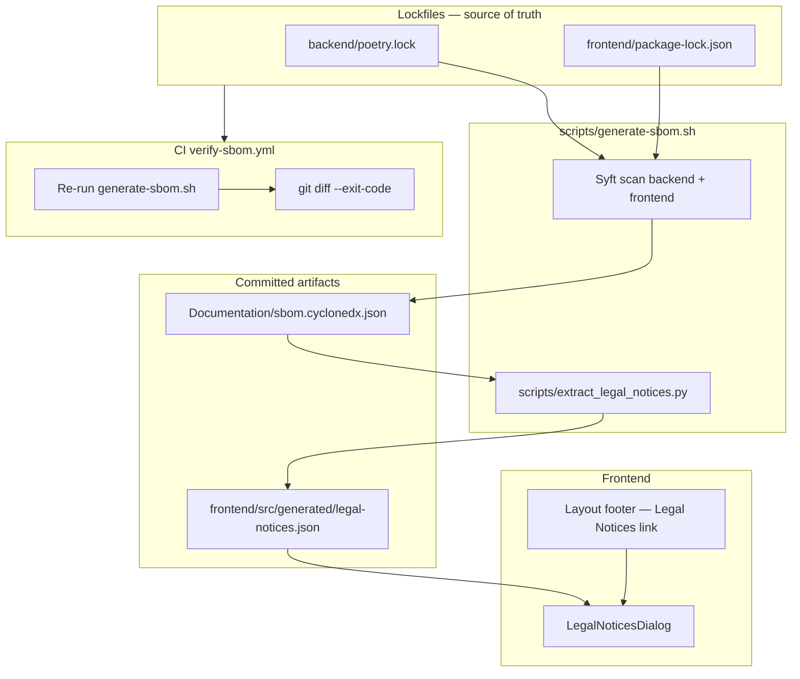

# Issue #138 — SBOM Automation & Legal Notices UI

**Implementation plan and design decisions**

| Field | Value |
|-------|-------|
| **Issue** | [#138 — SBOM Automation & Legal Notices UI](https://github.com/amosproj/amos2026ss04-taskorbit-conversational-agent/issues/138) |
| **Repository** | `amosproj/amos2026ss04-taskorbit-conversational-agent` |
| **Branch** | `feature/138-sbom-legal-notices-ui` (from `main`) |
| **Status** | Planning — ready for implementation |
| **Assignees** | shikharthakur2404 (originally abdulmoeez1225, qiblatainf) |
| **Sprint board** | In Progress on `amos2026ss04-feature-board` |

---

## Table of contents

1. [Ticket context](#1-ticket-context)
2. [Project context](#2-project-context)
3. [Decisions summary](#3-decisions-summary)
4. [Tool choice: Syft](#4-tool-choice-syft)
5. [Automation model](#5-automation-model)
6. [Architecture](#6-architecture)
7. [File inventory](#7-file-inventory)
8. [Phase-by-phase implementation](#8-phase-by-phase-implementation)
9. [Acceptance criteria mapping](#9-acceptance-criteria-mapping)
10. [Definition of Done mapping](#10-definition-of-done-mapping)
11. [Common mistakes to avoid](#11-common-mistakes-to-avoid)
12. [Local verification checklist](#12-local-verification-checklist)
13. [PR template](#13-pr-template)
14. [Sprint planning documents (manual step)](#14-sprint-planning-documents-manual-step)
15. [Open items and follow-ups](#15-open-items-and-follow-ups)

---

## 1. Ticket context

### User story

> As a developer  
> I want the application to automatically generate an SBOM and display the third-party licenses as Legal Notices in the UI  
> So that I can view the open-source licenses and legal credits of the libraries used in the application

### Acceptance criteria (from GitHub issue)

1. An SCA tool (e.g. scatool.com or an alternative) is used to generate an up-to-date version of the SBOM
2. Project dependencies are successfully scanned using "blind accept" for license clearing (when using e.g. scatool.com)
3. The old SBOM in the Planning Documents is updated based on the tool output
4. A new "Legal Notices" section or modal is added to the UI
5. The UI component correctly renders and displays the automatically generated license information from the SCA tool

### How we interpret the ticket for TaskOrbit

| Original wording | Our approach |
|------------------|--------------|
| scatool.com or alternative | **Syft** — already referenced in `terraform/README.md`, no SaaS account needed |
| "blind accept" license clearing | Syft reads license metadata from lockfiles; packages with unknown licenses are flagged as `UNKNOWN` in the UI rather than hidden |
| Planning Documents SBOM | **Both:** committed `Documentation/sbom.cyclonedx.json` in-repo **and** manual paste into sprint XLSX/PDF at deliverable time |
| Legal Notices UI | Footer link opening a searchable dialog (shadcn/ui) |

### Team context

- Work starts from **`main`**; teammates are mostly on bug fixes and unlikely to add new packages during this sprint.
- No existing branch or scatool output from teammates — greenfield implementation.
- Terraform SBOM remains a **separate** concern (documented in `terraform/README.md`); not shown in the in-app Legal Notices UI.

---

## 2. Project context

### Repository layout

| Path | Stack | Role |
|------|-------|------|
| `backend/` | Python 3.11, FastAPI, Poetry, SQLAlchemy, LiveKit Agents | Token API, orchestration, Postgres persistence |
| `frontend/` | React 19, Vite 5, TypeScript, Tailwind v4, shadcn/ui | Voice UI, LiveKit client, agent config, history |
| `terraform/` | GCP IaC | Cloud Run, Cloud SQL, secrets, observability |
| `benchmarks/` | Python runner | Component benchmarking |
| `Documentation/` | Markdown | Architecture, CI/CD, team guides |
| `.github/workflows/` | GitHub Actions | Lint, smoke test, deploy, benchmarks |

### What already exists for SBOM / licenses

| Item | Status |
|------|--------|
| `Documentation/sbom.cyclonedx.json` | **Does not exist yet** |
| Legal Notices UI | **Does not exist yet** |
| CI SBOM verification | **Does not exist yet** |
| `terraform/README.md` § SBOM | Documents Syft for **Terraform providers only** |
| Root `LICENSE` | MIT |
| `backend/pyproject.toml` | Declares MIT license |
| Sprint planning docs | Binary PDF/XLSX under `Deliverables/sprint-*/` — not editable as text in CI |

### Frontend routes and layout (relevant for UI)

- **Router** (`frontend/src/router.tsx`): `/` (chat), `/config`, `/history`
- **Layout** (`frontend/src/components/Layout.tsx`): sticky header with nav + theme toggle; **no footer today**
- **UI kit**: shadcn new-york — has `button`, `card`, `scroll-area`, `dropdown-menu`; **no `dialog` yet**
- **Tests**: no Vitest/Jest in frontend; backend uses pytest only

### Dependencies to scan

Two lockfiles are the source of truth for runtime application dependencies:

1. `backend/poetry.lock` — Python packages (FastAPI, livekit-agents, SQLAlchemy, …)
2. `frontend/package-lock.json` — npm packages (React, LiveKit client, Radix, …)

### Branch naming convention

The repo predominantly uses:

```text
feature/<issue-number>-<short-slug>
```

**Recommended branch for this ticket:**

```bash
git checkout main
git pull origin main
git checkout -b feature/138-sbom-legal-notices-ui
```

Examples already on the remote: `feature/139-os-model-monitoring`, `feature/49-critical-action-confirmation`, `docs/151-api-usage-audit`.

---

## 3. Decisions summary

| Decision | Choice | Rationale |
|----------|--------|-----------|
| SCA / SBOM tool | **Syft** | In-repo precedent, CI-friendly, covers Poetry + npm, CycloneDX output |
| SBOM format | **CycloneDX JSON 1.5** | Standard, machine-readable, license metadata included |
| Scan scope | **backend + frontend only** | What ships in product Docker images; Terraform is ops/IaC, not end-user software |
| UI placement | **Footer link → dialog** | Industry standard for legal/OSS notices; keeps main nav focused on product features |
| Data delivery to UI | **Static JSON at build time** | No runtime Syft, no new API endpoint, works with nginx static deploy |
| Planning documents | **Repo SBOM + manual sprint update** | Automate source of truth in git; paste summary into XLSX/PDF when sprint deliverable is due |
| CI enforcement | **Regenerate + `git diff --exit-code`** | Fails PR if lockfiles change without updated artifacts |
| Frontend tests | **Out of scope for v1** | No test runner in frontend; backend pytest covers extraction logic |

---

## 4. Tool choice: Syft

### Why Syft (not scatool.com)

| Criterion | Syft | scatool.com |
|-----------|------|-------------|
| Already in repo docs | Yes (`terraform/README.md`) | No |
| Monorepo (Poetry + npm) | One tool, one CLI | Separate SaaS workflow |
| CI / GitHub Actions | `anchore/syft-action`, no API keys | Requires account + manual review UI |
| Output for UI | CycloneDX → extract licenses | Export-dependent |
| Fit for in-app Legal Notices | Direct | Better for legal-team sign-off workflows |

### Alternatives considered

| Tool | Verdict |
|------|---------|
| `pip-licenses` / `license-checker` | License list only — not a real SBOM |
| ORT (OSS Review Toolkit) | Powerful but heavy for this ticket |
| Dependabot | Complementary (bumps deps); does not replace SBOM |

### Terraform SBOM (separate)

Infrastructure provider dependencies are documented separately:

- See `terraform/README.md` § SBOM
- Generate with Syft against `terraform/` when provider versions change
- **Do not** merge into the in-app Legal Notices dialog

---

## 5. Automation model

### What is automated

| Layer | What runs | When |
|-------|-----------|------|
| **Local script** | `scripts/generate-sbom.sh` | Developer runs after changing dependencies |
| **CI** | Same script in `verify-sbom.yml` | Every push / PR; fails if artifacts are stale |
| **UI** | Reads committed `legal-notices.json` | At build time — no live scan at runtime |

### What is not automated

| Item | Why |
|------|-----|
| Sprint XLSX/PDF update | Binary deliverables; manual paste once per sprint |
| Syft on every `git commit` | Too heavy for pre-commit; CI is sufficient |
| Terraform SBOM in UI | Different audience (ops vs end users) |

### Developer workflow after implementation

```text
Developer changes deps (poetry add / npm install)
        ↓
Lockfile updated (poetry.lock / package-lock.json)
        ↓
./scripts/generate-sbom.sh
        ↓
Commit: lockfile + Documentation/sbom.cyclonedx.json + frontend/src/generated/legal-notices.json
        ↓
CI verify-sbom: re-runs script, git diff must be empty
        ↓
Deploy: frontend bundles legal-notices.json → footer shows current licenses
```

---

## 6. Architecture



### UI layout change

```text
┌─────────────────────────────────────────────┐
│ Header: Chat | Agent Config | History | 🌙   │
├─────────────────────────────────────────────┤
│                                             │
│              <main> page content            │
│                                             │
├─────────────────────────────────────────────┤
│ Footer: Legal Notices · © 2026 TaskOrbit    │
└─────────────────────────────────────────────┘
         │
         └── click → Legal Notices dialog
                     (searchable package list)
```

**Layout structure:**

```tsx
<div className="flex min-h-svh flex-col">
  <header>...</header>
  <main className="flex-1"><Outlet /></main>
  <footer>...</footer>
</div>
```

---

## 7. File inventory

### New files to create

| Path | Purpose |
|------|---------|
| `scripts/generate-sbom.sh` | Orchestrates Syft scan + license extraction |
| `scripts/extract_legal_notices.py` | Parses CycloneDX → UI JSON (stdlib only) |
| `Documentation/sbom.cyclonedx.json` | Combined SBOM (generated, **committed**) |
| `Documentation/sbom.md` | Regeneration guide, scope, CI behaviour |
| `frontend/src/generated/legal-notices.json` | License list for UI (generated, **committed**) |
| `frontend/src/types/legalNotices.ts` | TypeScript types |
| `frontend/src/components/LegalNoticesDialog.tsx` | Modal with searchable license table |
| `frontend/src/components/ui/dialog.tsx` | shadcn dialog (`npx shadcn@latest add dialog`) |
| `backend/tests/test_extract_legal_notices.py` | Unit tests for extraction logic |
| `backend/tests/fixtures/sample.cyclonedx.json` | Minimal CycloneDX fixture |
| `.github/workflows/verify-sbom.yml` | CI: regenerate and fail on diff |

### Files to modify

| Path | Change |
|------|--------|
| `frontend/src/components/Layout.tsx` | Add footer + Legal Notices trigger |
| `frontend/tsconfig.app.json` | Ensure `resolveJsonModule: true` |
| `frontend/src/vite-env.d.ts` | JSON import types if needed |
| `README.md` | Short SBOM / Legal Notices section |
| `frontend/README.md` | Mention generated legal notices file |
| `Documentation/README.md` | Link to `sbom.md` and this plan |
| `.pre-commit-config.yaml` | Exclude `Documentation/sbom.cyclonedx.json` from 1 MB file check if needed |

### Files to leave unchanged

| Path | Reason |
|------|--------|
| `terraform/README.md` | Terraform SBOM stays separate |
| `backend/src/taskorbit/api/main.py` | No API endpoint needed |
| `backend/pyproject.toml` | No new runtime dependencies |

---

## 8. Phase-by-phase implementation

**Estimated total:** ~5–6 hours focused work.

**Recommended order:**

```text
Phase 0  Branch setup
   ↓
Phase 1  generate-sbom.sh
   ↓
Phase 2  extract_legal_notices.py
   ↓
Phase 3  Initial artifacts + pre-commit fix if needed
   ↓
Phase 5  Unit tests (alongside extractor)
   ↓
Phase 4  Frontend UI
   ↓
Phase 6  Documentation
   ↓
Phase 7  CI workflow
   ↓
Phase 8  Manual sprint doc (at deliverable time)
   ↓
PR + peer review
```

---

### Phase 0 — Branch and prerequisites (~15 min)

```bash
git checkout main
git pull origin main
git checkout -b feature/138-sbom-legal-notices-ui
```

**Local Syft install (macOS):**

```bash
brew install syft
syft version
```

**CI:** pin `anchore/syft-action@v1` with an explicit version (e.g. `v1.18.0`).

---

### Phase 1 — `scripts/generate-sbom.sh` (~45 min)

**Behaviour:**

1. Resolve repo root from script location
2. Fail fast if `syft` is not on `PATH`
3. Run Syft against backend and frontend with exclusions
4. Write `Documentation/sbom.cyclonedx.json`
5. Run `python3 scripts/extract_legal_notices.py`
6. Print summary (component count, timestamp)

**Recommended Syft command (single combined scan):**

```bash
syft scan "dir:backend" "dir:frontend" \
  --exclude './backend/**/__pycache__/**' \
  --exclude './backend/**/.venv/**' \
  --exclude './backend/**/tests/**' \
  --exclude './frontend/**/node_modules/**' \
  --exclude './frontend/**/dist/**' \
  -o cyclonedx-json@1.5 \
  -q > Documentation/sbom.cyclonedx.json
```

```bash
chmod +x scripts/generate-sbom.sh
```

---

### Phase 2 — `scripts/extract_legal_notices.py` (~1 h)

**Input:** `Documentation/sbom.cyclonedx.json`  
**Output:** `frontend/src/generated/legal-notices.json`

**Output JSON schema:**

```json
{
  "generatedAt": "2026-07-01T12:00:00Z",
  "sbomVersion": "1.5",
  "scope": ["backend", "frontend"],
  "componentCount": 142,
  "components": [
    {
      "name": "fastapi",
      "version": "0.115.0",
      "license": "MIT",
      "ecosystem": "python",
      "purl": "pkg:pypi/fastapi@0.115.0"
    }
  ]
}
```

**Extraction rules:**

1. Read `components` from the CycloneDX BOM
2. Resolve license per component:
   - Prefer `licenses[0].license.id` (SPDX)
   - Else `licenses[0].license.name`
   - Else `"UNKNOWN"` (still include the package)
3. Dedupe by `ecosystem + name + version` (lowercase name)
4. Sort by ecosystem, then name, then version
5. Keep only package components (`purl` starts with `pkg:`)
6. Set `generatedAt` (UTC ISO-8601) and `componentCount`

**CLI:**

```bash
python3 scripts/extract_legal_notices.py \
  --input Documentation/sbom.cyclonedx.json \
  --output frontend/src/generated/legal-notices.json
```

Use **stdlib only** — runnable with system `python3` in CI (same pattern as `scripts/validate_agent_configs.py`).

---

### Phase 3 — Generate initial artifacts (~15 min)

```bash
./scripts/generate-sbom.sh
```

**Sanity checks:**

- [ ] `legal-notices.json` is valid JSON
- [ ] Contains expected packages (`fastapi`, `react`, `livekit-client`, …)
- [ ] No secrets or API keys in either file
- [ ] `componentCount` matches array length

**Pre-commit pitfall:** `.pre-commit-config.yaml` rejects files &gt; 1 MB. If `sbom.cyclonedx.json` exceeds that, add an exclude:

```yaml
# In check-added-large-files exclude or global exclude
Documentation/sbom\.cyclonedx\.json
```

```bash
git add Documentation/sbom.cyclonedx.json frontend/src/generated/legal-notices.json
```

---

### Phase 4 — Frontend UI (~1.5 h)

#### 4a. Add shadcn dialog

```bash
cd frontend
npx shadcn@latest add dialog
```

#### 4b. Types — `frontend/src/types/legalNotices.ts`

```typescript
export type LegalNoticeComponent = {
  name: string;
  version: string;
  license: string;
  ecosystem: "python" | "npm" | string;
  purl?: string;
};

export type LegalNoticesFile = {
  generatedAt: string;
  sbomVersion: string;
  scope: string[];
  componentCount: number;
  components: LegalNoticeComponent[];
};
```

#### 4c. `LegalNoticesDialog.tsx`

- Import: `import legalNotices from "@/generated/legal-notices.json"`
- Title: **Legal Notices**
- Description: open-source licenses for third-party software used in TaskOrbit
- Show formatted `generatedAt`
- Search/filter by package name or license string
- Scrollable table: Package | Version | License
- Ecosystem badge (`python` / `npm`)
- `UNKNOWN` licenses: muted style + tooltip
- Accessible: `DialogTitle`, `DialogDescription`, keyboard dismiss
- **v1:** SPDX / license names only — do not embed full license text bodies

#### 4d. Update `Layout.tsx`

- Wrap layout in `flex min-h-svh flex-col`
- `main` gets `flex-1`
- Footer: `Legal Notices` button (link style) + copyright year + `VITE_APP_NAME`

#### 4e. TypeScript

Verify `frontend/tsconfig.app.json`:

```json
"resolveJsonModule": true
```

#### 4f. Build check

```bash
cd frontend && npm run build
```

---

### Phase 5 — Unit tests (~45 min)

#### `backend/tests/fixtures/sample.cyclonedx.json`

Cover:

- SPDX license `id`
- License `name` only (no id)
- Missing license → `UNKNOWN`
- Duplicate components (dedupe)
- Non-package component without `pkg:` purl (skip)

#### `backend/tests/test_extract_legal_notices.py`

| Test | Asserts |
|------|---------|
| `test_extracts_spdx_license_id` | SPDX id used |
| `test_falls_back_to_license_name` | Name used when no id |
| `test_unknown_when_no_license` | `UNKNOWN` placeholder |
| `test_dedupes_components` | No duplicate rows |
| `test_sorts_alphabetically` | Stable sort order |
| `test_skips_non_package_components` | Only `pkg:` purls |
| `test_output_schema` | Required top-level fields |

```bash
cd backend && poetry run pytest tests/test_extract_legal_notices.py -v
```

---

### Phase 6 — Documentation (~30 min)

#### `Documentation/sbom.md` (operational guide)

Include:

1. Purpose (compliance, issue #138)
2. Scope: backend + frontend; terraform separate
3. Tool: Syft + link
4. Regenerate: `./scripts/generate-sbom.sh`
5. Artifacts and their paths
6. When to regenerate (lockfile changes)
7. CI: `verify-sbom.yml`
8. Sprint planning: manual XLSX/PDF step
9. Link to this plan document

#### `README.md` (root)

Add subsection:

```markdown
## SBOM & Legal Notices

Third-party dependencies are tracked with [Syft](https://github.com/anchore/syft).
See [Documentation/sbom.md](Documentation/sbom.md). Legal Notices are available
in the application footer.
```

---

### Phase 7 — CI workflow (~45 min)

#### `.github/workflows/verify-sbom.yml`

```yaml
name: Verify SBOM

on:
  push:
    branches: ["**"]
  pull_request:
  workflow_dispatch:

jobs:
  verify-sbom:
    runs-on: ubuntu-latest
    timeout-minutes: 10
    steps:
      - uses: actions/checkout@v4

      - name: Install Syft
        uses: anchore/syft-action@v1
        with:
          version: v1.18.0

      - name: Regenerate SBOM artifacts
        run: ./scripts/generate-sbom.sh

      - name: Verify committed artifacts are up to date
        run: |
          git diff --exit-code \
            Documentation/sbom.cyclonedx.json \
            frontend/src/generated/legal-notices.json \
          || (echo "::error::SBOM artifacts are stale. Run ./scripts/generate-sbom.sh and commit." && exit 1)
```

This workflow is **independent** of deploy gates (same pattern as `validate-agent-configs.yml`).

---

## 9. Acceptance criteria mapping

| # | Criterion | Implementation | Verification |
|---|-----------|----------------|--------------|
| 1 | SCA tool generates up-to-date SBOM | Syft → `Documentation/sbom.cyclonedx.json` | File exists; CI passes |
| 2 | Dependencies scanned for licenses | Syft reads lockfile metadata; unknown → `UNKNOWN` in UI | Spot-check MIT/GPL packages |
| 3 | Planning Documents SBOM updated | Committed CycloneDX + manual sprint paste | PO / sprint review |
| 4 | Legal Notices section/modal in UI | Footer link + `LegalNoticesDialog` | Manual UI test |
| 5 | UI renders auto-generated license info | Imports `legal-notices.json` from Syft pipeline | Compare UI count vs JSON `componentCount` |

---

## 10. Definition of Done mapping

| DoD item | Action |
|----------|--------|
| Coding standards (formatting, comments, logging, no API keys) | ruff, ESLint, Prettier; no secrets in generated JSON |
| Peer review | PR to `main`, ≥1 reviewer |
| Documentation updated | `sbom.md`, READMEs, this plan |
| Unit tests for new features | `test_extract_legal_notices.py` |
| Feature fully implemented | All phases complete |
| Merged to mainline + deployed to PROD | Normal release via `prod` branch deploy |
| All acceptance criteria met | Checklist in §9 |
| Product owner approved | Move card to Done on feature board |
| All tests passing | backend pytest + all CI workflows green |
| Developers agreed to release | Team release sign-off |

---

## 11. Common mistakes to avoid

| Mistake | Prevention |
|---------|------------|
| Scanning `node_modules` / `.venv` as primary source | Syft uses lockfiles; exclude build/cache dirs |
| Gitignoring generated JSON | **Commit** `sbom.cyclonedx.json` and `legal-notices.json` |
| SBOM &gt; 1 MB fails pre-commit | Exclude `Documentation/sbom.cyclonedx.json` from large-file hook |
| Using dialog before adding component | Run `npx shadcn@latest add dialog` first |
| TypeScript JSON import errors | `resolveJsonModule: true` in tsconfig |
| Footer not sticking to bottom on short pages | `min-h-svh flex flex-col` + `main flex-1` |
| Including Terraform in Legal Notices UI | Scope = backend + frontend only |
| Running Syft in production container | Static JSON bundled at frontend build time |
| Forgetting to regen after dep bump | CI `git diff --exit-code` |
| Secrets in SBOM output | Never commit `.env`; Syft scans package metadata only |
| Duplicate rows in UI | Dedupe in `extract_legal_notices.py` |
| Unpinned Syft version in CI | Pin `anchore/syft-action` version tag |

---

## 12. Local verification checklist

Run before opening the PR:

```bash
# 1. Regenerate artifacts
./scripts/generate-sbom.sh

# 2. Extraction unit tests
cd backend && poetry run pytest tests/test_extract_legal_notices.py -v && cd ..

# 3. Backend CI equivalent
cd backend && poetry run ruff check . && poetry run ruff format --check . && poetry run pytest && cd ..

# 4. Frontend CI equivalent
cd frontend && npm run lint && npm run format:check && npm run build && cd ..

# 5. Pre-commit (if installed)
poetry -C backend run pre-commit run --all-files

# 6. Manual UI smoke test
cd frontend && npm run dev
# → http://localhost:5173
# → footer "Legal Notices" → dialog opens
# → search "react" → results appear
# → dark mode still readable
```

---

## 13. PR template

**Title:** `feat: automate SBOM generation and add Legal Notices UI (#138)`

**Body:**

```markdown
## Summary
- Add Syft-based SBOM generation for backend (Poetry) and frontend (npm)
- Commit CycloneDX SBOM and extracted legal-notices.json for the UI
- Add footer "Legal Notices" dialog showing third-party packages and licenses
- Add CI workflow to verify SBOM artifacts stay in sync with lockfiles
- Document regeneration in Documentation/sbom.md

Closes #138

## Acceptance criteria
- [x] Syft generates up-to-date SBOM
- [x] Dependencies scanned from lockfiles
- [x] SBOM committed under Documentation/
- [x] Legal Notices modal in UI
- [x] UI renders generated license data

## Test plan
- [ ] `./scripts/generate-sbom.sh` succeeds locally
- [ ] `poetry run pytest tests/test_extract_legal_notices.py` passes
- [ ] `npm run build` passes
- [ ] Footer → Legal Notices opens; search works
- [ ] CI `Verify SBOM` workflow green
```

**Suggested commits:**

1. `chore: add SBOM generation scripts and initial artifacts`
2. `feat(frontend): add Legal Notices dialog in footer`
3. `ci: add verify-sbom workflow`
4. `test: add legal notices extraction tests`
5. `docs: add SBOM documentation and implementation plan`

---

## 14. Sprint planning documents (manual step)

When submitting sprint deliverables (`Deliverables/sprint-*/planning-documents.xlsx` / `.pdf`), paste:

| Field | Source |
|-------|--------|
| SBOM tool | Syft |
| SBOM format | CycloneDX JSON 1.5 |
| Repository path | `Documentation/sbom.cyclonedx.json` |
| Component count | `legal-notices.json` → `componentCount` |
| Last generated | `legal-notices.json` → `generatedAt` |
| Scan scope | backend (Poetry) + frontend (npm) |
| UI location | Application footer → Legal Notices dialog |
| Automation | `verify-sbom.yml` on every PR |
| Regenerate command | `./scripts/generate-sbom.sh` |

Do **not** attempt to auto-edit binary XLSX/PDF in CI.

---

## 15. Open items and follow-ups

| Item | Priority | Notes |
|------|----------|-------|
| Add `verify-sbom` to required PR checks | Medium | After first green run on the PR |
| Weekly scheduled SBOM drift PR | Low | Usually unnecessary if CI gates lockfiles |
| Full license text in UI | Low | v1 shows SPDX/names only |
| Frontend Vitest for dialog | Low | No test infra today |
| Merge terraform SBOM into monorepo doc index | Low | Keep separate artifacts |
| scatool.com compliance workflow | Out of scope | Syft replaces for this MVP |

---

## Related documentation

| Document | Relevance |
|----------|-----------|
| [`terraform/README.md`](../terraform/README.md) § SBOM | Terraform provider SBOM (separate) |
| [`Documentation/ci-cd.md`](ci-cd.md) | CI patterns for new workflow |
| [`frontend/README.md`](../frontend/README.md) | shadcn setup, build commands |
| [Syft documentation](https://github.com/anchore/syft) | Tool reference |
| [CycloneDX specification](https://cyclonedx.org/) | SBOM format |

---

*Last updated: 2026-07-01 — planning document for issue #138. Update this file if design decisions change during implementation.*
