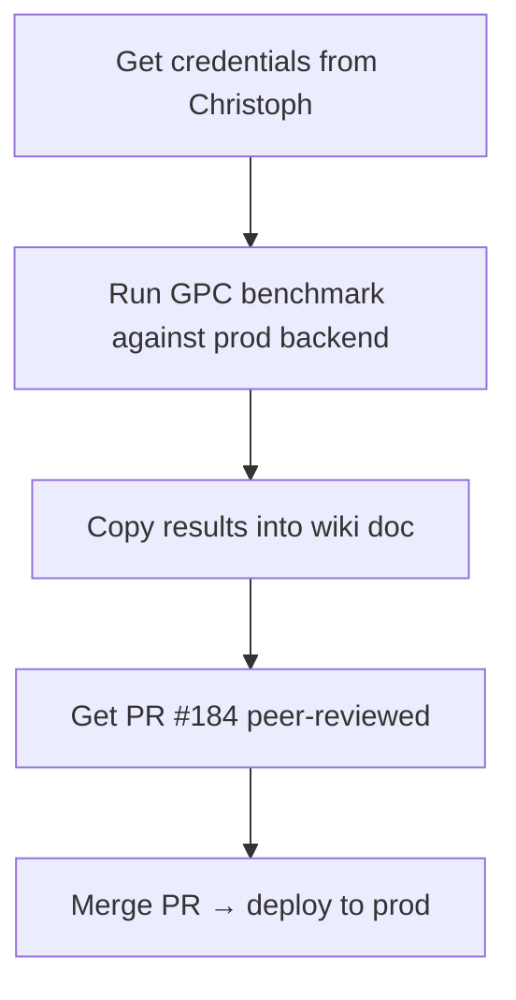

# #68 Component Benchmark — Closure Checklist



## 1. Get credentials

Ask Christoph for:

| Item | Why |
|------|-----|
| **OpenAI API key with billing** | Current key returns `insufficient_quota` |
| **Cloud Run URL** | Deployed backend at e.g. `https://taskorbit-api-xxxxx-ew.a.run.app` — localhost can't reach the Ollama VM |
| **Benchmark auth token** | If prod requires `BENCHMARK_API_TOKEN` for `Authorization: Bearer <token>` |

## 2. Run the GPC benchmark

On `Feature-Component-Benchmarking-68` branch:

```bash
# 1. Set env vars
export BENCHMARK_API_URL=https://<cloud-run-url>
export OPENAI_API_KEY=<funded-key>

# 2. Run the original config (cloud + OSS, text + voice, 5 reps)
python benchmarks/runner/run_component_benchmark.py \
  --config benchmarks/configs/component-benchmark.yaml \
  --results-dir benchmarks/results/gpc-prod-$(date +%Y%m%dT%H%M%S)/component

# 3. Aggregate results
python benchmarks/runner/aggregate.py \
  --results-dir benchmarks/results/gpc-prod-$(date +%Y%m%dT%H%M%S) \
  --report --write-report benchmarks/results/gpc-prod-$(date +%Y%m%dT%H%M%S)/report.txt
```

Expected run time: ~45-60 min (warmup + 5 reps × 6 prompts × 2 paths × 2 configs at ~2-3 min each).

## 3. Copy results to wiki

Open `Documentation/wiki-component-benchmarking.md` and paste the `--report` output into the GPC results table. Follow the existing template at the bottom of the doc.

## 4. Get PR reviewed & merged

- Tag a reviewer on PR #184
- After merge, deploy to prod via the existing CI/CD pipeline

## Files

| File | Purpose |
|------|---------|
| `benchmarks/configs/component-benchmark.yaml` | Production config (cloud + OSS, text + voice, 5 reps) |
| `benchmarks/configs/component-benchmark-oss-only.yaml` | OSS smoke config (1 rep, text only) |
| `benchmarks/scripts/run-gpc-benchmark.sh` | Wrapper script for GPC standardized run |
| `benchmarks/runner/run_component_benchmark.py` | Main benchmark harness |
| `benchmarks/runner/aggregate.py` | Result aggregation + report generator |
| `Documentation/wiki-component-benchmarking.md` | Wiki doc (results tables to fill) |
